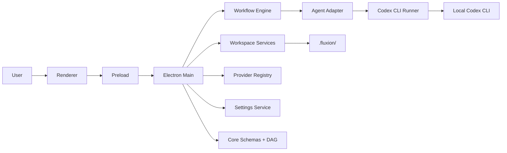
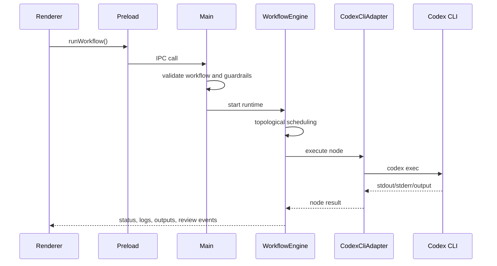

# Fluxion Architecture

Current architecture of Fluxion based on the repository implementation.

This document is the canonical technical reference for runtime boundaries, workflow execution, persistence, and IPC. It intentionally focuses on the code that exists today rather than aspirational design.

## System Goal

Fluxion is a Windows-first Electron desktop app for turning repeatable `codex exec` work into durable visual workflows.

Core product properties:

- local Codex CLI runtime
- DAG-based execution
- workspace-local persistence
- human review checkpoints
- typed contracts between layers

## Layer Boundaries

```text
src/core     workflow schemas, DAG validation, artifacts, run-state contracts
src/shared   shared workflow, provider, and IPC types
src/main     Electron main process, IPC handlers, services, runners, adapters
src/preload  typed contextBridge bridge
src/renderer React UI, React Flow canvas, Zustand stores, terminal viewer
```

Rules:

- `src/core` must stay free of Electron and React imports
- `src/main` owns filesystem, process execution, provider discovery, and orchestration
- `src/preload` stays thin
- `src/renderer` does not own backend logic
- IPC contract changes start in `src/shared`

## Runtime Topology



## Main Product Path

The primary runtime is the local Codex CLI.

An OpenAI adapter exists in the codebase, but it is not the default product path and should not be described that way unless explicitly requested.

## Workflow Model

Workflows are DAGs composed of:

- `Workflow`
- `WorkflowNode`
- `WorkflowEdge`

Node data includes:

- provider and model
- prompt and system instruction
- `requires` and `produces`
- human review configuration
- retry policy
- Codex runtime options such as sandbox and approval settings

## Persistence Model

Fluxion stores runtime state inside the workspace:

```text
.fluxion/
|-- context.json
|-- workflow.json
|-- workflows/*.fluxion.json
|-- memory/**/*.md
`-- runs/*.json
```

Application-level state lives in Electron `userData`, including settings, trusted workspaces, and recent workspaces.

## Execution Flow



Important behavior:

- DAG validation happens before execution
- parallel branches may run concurrently within the process manager limit
- review checkpoints can pause execution
- run state persists under `.fluxion/runs`

## IPC Shape

Two IPC styles are used:

- command-style request/response for actions like open workspace, save workflow, scan context, and update settings
- event-style streaming for terminal output, node status, outputs, review requests, and workflow completion

When an IPC contract changes, update:

1. `src/shared`
2. `src/preload`
3. `src/main`
4. `src/renderer`

## Workspace Lifecycle

Opening a workspace typically does this:

1. confirm workspace trust
2. initialize `.fluxion/`
3. load workflows
4. load context
5. start file watching
6. hydrate renderer state

Fluxion supports both legacy `.fluxion/workflow.json` and current `.fluxion/workflows/*.fluxion.json`.

## Context and Memory

Context scanning builds a project description used by Fluxion and its exported agent files.

Key outputs:

- `.fluxion/context.json`
- `.fluxion/memory/global-context.md`

Node outputs are stored as markdown in `.fluxion/memory/` and can be reused as downstream context.

## Provider and Runner Notes

- `CodexCliAdapter` and `CodexCliRunner` are the production execution path
- provider capability discovery informs readiness and model selection in the UI
- the OpenAI adapter is present but secondary

## Windows-Specific Constraints

- path handling must remain Windows-safe
- process cleanup and abort flows are part of the product contract
- long-running execution belongs in the main process, not the renderer

## Canonical Related Docs

- [README.md](./README.md)
- [AGENTS.md](./AGENTS.md)
- [DESIGN.md](./DESIGN.md)
- [docs/agents/README.md](./docs/agents/README.md)
- [docs/runtime/codex-approval-status.md](./docs/runtime/codex-approval-status.md)

## Non-Goals of This Document

This file is not the backlog, not a QA script, and not a general product pitch. Keep those concerns in their own docs.

