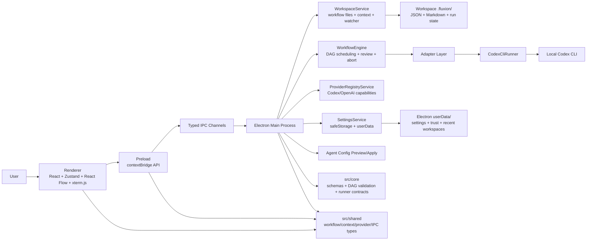
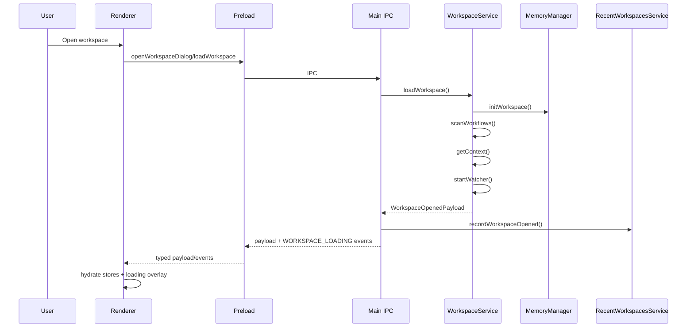
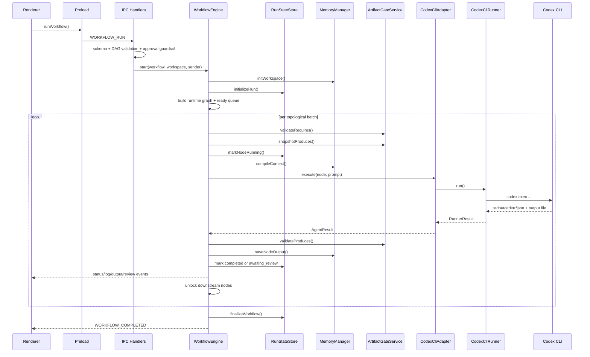

# Kiến Trúc Hệ Thống Fluxion

## 1. Mục Tiêu

Tài liệu này mô tả kiến trúc hệ thống hiện tại của Fluxion dựa trên mã nguồn trong repository. Nội dung tập trung vào cách các layer phối hợp với nhau, các contract dữ liệu chính, luồng runtime, persistence, IPC, execution engine, và các điểm mở rộng của dự án.

Tài liệu này không mô tả roadmap lý tưởng. Những phần đã có trong code nhưng chưa phải đường chạy chính sẽ được ghi rõ là phụ trợ hoặc còn dang dở.

## 2. Tổng Quan

Fluxion là một ứng dụng desktop Electron, React và TypeScript, được thiết kế Windows-first để biến các phiên `codex exec` lặp lại thành workflow trực quan dạng DAG. Người dùng có thể tạo node trên canvas, nối node thành luồng xử lý, chạy workflow cục bộ, xem log theo thời gian thực, review kết quả, retry, abort và lưu artifact trong workspace.

Kiến trúc hiện tại xoay quanh 4 nguyên tắc:

1. Renderer chỉ là lớp điều khiển và hiển thị.
2. Main process sở hữu filesystem, process execution, provider discovery và workflow orchestration.
3. `src/core` giữ các contract và validation độc lập với Electron/React.
4. Dữ liệu runtime quan trọng được typed, validate và persist local.

## 3. Sơ Đồ Tổng Thể



## 4. Layer Chính

| Layer                  | Thư mục                 | Trách nhiệm                                                                                                         |
| ---------------------- | ----------------------- | ------------------------------------------------------------------------------------------------------------------- |
| Core domain contracts  | `src/core`              | Zod schema, DAG validation, artifact validation, runner contract, run-state schema                                  |
| Shared app contracts   | `src/shared`            | Type dùng chung, IPC channel, IPC payload, provider metadata, workflow/context contract, guardrail                  |
| Backend runtime        | `src/main`              | Electron main process, IPC handlers, workflow engine, workspace service, provider registry, child-process lifecycle |
| Secure bridge          | `src/preload`           | Expose typed `window.api` bằng `contextBridge`                                                                      |
| Frontend control plane | `src/renderer`          | React UI, React Flow canvas, Zustand stores, terminal viewer, dialogs, autosave                                     |
| Tooling/build          | root config, `scripts/` | `electron-vite`, `electron-builder`, TypeScript, ESLint, Prettier, Vitest, smoke scripts                            |

### 4.1 Hướng Phụ Thuộc

```text
renderer -> preload -> main
renderer -> shared
preload -> shared
main -> shared
main -> core
core -> độc lập với Electron và React
```

Boundary quan trọng:

- `src/core` không import Electron hoặc React.
- `src/preload` là bridge mỏng, không chứa business logic.
- `src/renderer` không truy cập trực tiếp filesystem hoặc child process.
- `src/main` là nơi duy nhất sở hữu workspace persistence, process execution, provider discovery và workflow orchestration.
- Khi đổi IPC contract, thứ tự cập nhật đúng là `src/shared` -> `src/preload` -> `src/main` -> `src/renderer`.

## 5. Runtime Topology

Fluxion chạy trên 4 runtime logic.

### 5.1 Renderer Process

Renderer là bề mặt điều khiển của app:

- React 19
- React Flow canvas
- Zustand stores
- xterm.js terminal viewer
- các dialog context/settings/review

Renderer giữ state phục vụ editing và presentation. Renderer không chạy agent, không spawn process và không tự ghi file workspace.

### 5.2 Preload Process

Preload expose `window.api` qua `contextBridge`. API này map thao tác renderer sang IPC:

- request/response: open workspace, save workflow, get provider capabilities, save settings, preview agent config
- streaming event: terminal logs, node status, node output, review required, workspace loading, workflow completed

### 5.3 Main Process

Main process là backend runtime của app desktop:

- đăng ký IPC handlers
- mở và bootstrap workspace
- quản lý watcher
- validate workflow
- chạy workflow engine
- spawn và kill Codex CLI
- persist context, workflow, run state, memory output và settings

### 5.4 Child Process

Khi workflow chạy, Fluxion spawn child process cho `codex exec`. Process lifecycle được quản lý bởi `ProcessManager`:

- giới hạn mặc định `maxConcurrent = 5`
- spawn với `windowsHide: true`
- abort process tree trên Windows bằng `taskkill /T`, sau đó force bằng `taskkill /T /F` nếu cần

## 6. Mô Hình Dữ Liệu Cốt Lõi

### 6.1 Workflow

Workflow là DAG gồm:

- `Workflow`
- `WorkflowNode`
- `WorkflowEdge`

Mỗi node chứa `AgentNodeData`:

- `provider`
- `model`
- `runner`
- `prompt`
- `systemInstruction`
- `requires`
- `produces`
- `humanReview`
- `retryPolicy`
- model parameters như `temperature`, `maxTokens`, `reasoningLevel`
- Codex execution options như `sandboxMode`, `approvalPolicy`, `windowsSandbox`, `profile`, `config`

### 6.2 Hai Lớp Contract Workflow

Repo hiện có 2 lớp contract workflow:

- `src/shared/workflow.types.ts`: type dùng chung giữa renderer, preload, main và IPC
- `src/core/schema/workflow.schema.ts`: Zod schema dùng để validate payload và runtime input

Cách tách này giúp boundary rõ ràng, nhưng cũng tạo rủi ro drift. Khi đổi shape workflow, cả shared type và core schema cần được cập nhật cùng nhau.

### 6.3 Runtime Status

Renderer và persisted run-state dùng 2 hệ trạng thái khác nhau:

- UI node status: `idle | running | stopping | completed | error | paused`
- persisted run status: `pending | running | awaiting_review | completed | failed | aborted | rejected`

`paused` trên UI tương ứng với `awaiting_review` trong run-state trên disk.

### 6.4 Project Context

`ProjectContextDraft` mô tả workspace để Fluxion và agent sử dụng:

- mục tiêu dự án
- target users
- stack, framework, package manager, build/test command
- important paths, module boundaries
- generated/ignored paths
- risk flags
- command catalog
- component inventory
- agent instruction sources
- security policy
- readiness
- source evidence

Context được lưu thành:

- `.fluxion/context.json`
- `.fluxion/memory/global-context.md`

Execution engine không đọc trực tiếp `context.json`; nó đọc Markdown memory đã được materialize từ context.

### 6.5 Artifact Contracts

Node có thể khai báo:

- `requires`: artifact cần có trước khi node chạy
- `produces`: artifact node dự kiến tạo hoặc cập nhật

Artifact path bắt buộc là workspace-relative, không được có `..`, và không được escape workspace root.

## 7. Persistence

### 7.1 Dữ Liệu Trong Workspace

```text
.fluxion/
|-- context.json
|-- workflow.json                    # legacy single-workflow format
|-- workflows/
|   `-- *.fluxion.json               # current multi-workflow format
|-- memory/
|   |-- global-context.md
|   |-- short-term/
|   |   `-- <workflowId>/<nodeId>.md
|   `-- long-term/
|       `-- index.md
|-- runs/
|   `-- <runId>.json
`-- tmp/
    `-- codex/<runId>/<nodeId>/last-message.md
```

### 7.2 Dữ Liệu Trong Electron `userData`

```text
<userData>/
|-- fluxion-settings.json
|-- trusted-workspaces.json
`-- recent-workspaces.json
```

### 7.3 Ý Nghĩa Kiến Trúc

- Không có database server.
- Workflow, context, memory và run-state nằm trong workspace.
- Settings, trusted workspace list và recent workspace list nằm trong Electron `userData`.
- Workspace là source of truth cho workflow runtime artifacts.
- `userData` là source of truth cho cấu hình app-level.

## 8. Workspace Lifecycle

Mở workspace là luồng bootstrap trung tâm của app.



### 8.1 Các Bước Chính

1. Renderer mở dialog chọn folder.
2. Renderer kiểm tra workspace trust. Nếu workspace chưa trusted, UI yêu cầu người dùng xác nhận.
3. Main gọi `workspaceService.loadWorkspace()`.
4. `WorkspaceService` gọi `memoryManager.initWorkspace()` để tạo cấu trúc `.fluxion/memory`.
5. Service scan legacy workflow và multi-workflow catalog.
6. Nếu workspace chưa có workflow, service tạo workflow mặc định.
7. Service đọc `.fluxion/context.json`.
8. Service start `chokidar` watcher.
9. Main trả `WorkspaceOpenedPayload` và record recent workspace.
10. Renderer hydrate `useWorkflowStore` và reset `useExecutionStore`.

### 8.2 Legacy Workflow Migration

Fluxion hỗ trợ cả:

- `.fluxion/workflow.json`
- `.fluxion/workflows/*.fluxion.json`

Khi user migrate legacy workflow:

- main đọc workflow cũ
- ghi workflow mới vào `.fluxion/workflows/`
- backup file cũ vào `.fluxion/legacy/`
- cập nhật context onboarding metadata
- reload workspace

### 8.3 Workspace Watcher

`WorkspaceService` watch toàn workspace nhưng ignore:

- `.git`
- `node_modules`
- `.fluxion/memory`
- `out`
- `dist`

Watcher phục vụ:

- thông báo thay đổi file từ bên ngoài app
- phát hiện active workflow file bị sửa ngoài Fluxion
- kích hoạt banner reload/dirty state trong renderer

Các lần write workflow do chính Fluxion tạo được suppress ngắn hạn để tránh self-notification.

## 9. Context Intelligence Subsystem

Context subsystem giúp Fluxion hiểu workspace ở mức heuristic trước khi chạy workflow.

### 9.1 Thành Phần

| Thành phần                 | Vai trò                                                                                     |
| -------------------------- | ------------------------------------------------------------------------------------------- |
| `workspace-snapshot.ts`    | Tạo snapshot có giới hạn của workspace và bỏ qua thư mục nặng                               |
| `project-detectors.ts`     | Detector cho Node, Java, Python, Go, Rust, .NET, PHP, Ruby, mobile, infra, monorepo, README |
| `context-synthesizer.ts`   | Tổng hợp detector output thành `ContextScanResult`                                          |
| `readiness-evaluator.ts`   | Đánh giá context đã đủ để bắt đầu chưa                                                      |
| `evidence-store.ts`        | Deduplicate source evidence và cấp ID                                                       |
| `context-scout.service.ts` | Facade `scanWorkspaceContext()`                                                             |

### 9.2 Cách Hoạt Động

1. `createWorkspaceSnapshot()` duyệt workspace với giới hạn:
   - depth mặc định 8
   - tối đa 8000 entries
   - tối đa 256 KB khi đọc text file
2. `runProjectDetectors()` đọc signal files như `package.json`, `pyproject.toml`, `pom.xml`, README, lockfile, config file.
3. `synthesizeContextScanResult()` tạo:
   - workspace type
   - stack
   - command catalog
   - component inventory
   - instruction sources
   - security policy
   - unresolved fields
4. Khi user lưu context, `WorkspaceService` ghi:
   - `.fluxion/context.json`
   - `.fluxion/memory/global-context.md`

### 9.3 Tác Động Lên Runtime

Execution engine compile prompt từ memory files. Vì vậy context onboarding chỉ ảnh hưởng execution sau khi được ghi thành Markdown global context.

## 10. Workflow Authoring

Frontend tách state thành 2 Zustand stores:

| Store               | Trách nhiệm                                                                                           |
| ------------------- | ----------------------------------------------------------------------------------------------------- |
| `useWorkflowStore`  | graph canvas, workspace state, workflow catalog, context state, autosave state, provider capabilities |
| `useExecutionStore` | terminal logs, node runtime status, review state, output path, compiled context                       |

### 10.1 Lý Do Tách Store

Canvas state thay đổi theo editing. Runtime log thay đổi tần suất cao. Tách execution state khỏi workflow graph giúp hạn chế React Flow rerender khi terminal nhận log chunk.

### 10.2 Thành Phần UI Chính

- `AppShell`: khung app chính
- `Sidebar`: workflow catalog
- `Topbar`: open/save/run/settings/workspace actions
- `FlowCanvas`: DAG editor bằng React Flow
- `PropertiesPanel`: chỉnh node và workflow config
- `TerminalViewer`: log và output runtime
- `ContextInitModal`: onboarding context
- `GlobalSettingsDialog`: provider settings
- `WorkspaceOpeningOverlay`: progress khi mở workspace
- `ConfirmDialog`, `InputDialog`, `TextEditorDialog`: dialog primitives

### 10.3 Autosave

`useWorkflowPersistence()` debounce save 800 ms khi:

- đã có workspace
- workflow dirty
- không đang save

Autosave gọi `saveCurrentWorkflow()`, sau đó đi qua `window.api.saveWorkflow(...)`.

## 11. IPC Architecture

IPC được chia thành 2 nhóm.

### 11.1 Command-Style IPC

Các channel `ipcMain.handle` dùng cho request/response:

- workspace open/load/save/read file
- create/load/delete workflow
- get/scan/save context
- trust workspace
- list recent workspaces
- get provider capabilities
- get/update settings
- shell open/reveal path
- agent config preview/apply
- workflow abort/review actions

### 11.2 Event-Style IPC

Các event `sender.send` dùng cho streaming và async state:

- `WORKSPACE_LOADING`
- `WORKSPACE_FILE_CHANGED`
- `TERMINAL_DATA_BATCH`
- `TERMINAL_ERROR`
- `TERMINAL_EXIT`
- `WORKFLOW_NODE_STATUS`
- `WORKFLOW_NODE_OUTPUT`
- `WORKFLOW_REVIEW_REQUIRED`
- `MEMORY_CONTEXT_READY`
- `WORKFLOW_COMPLETED`

### 11.3 Lý Do Thiết Kế

- Request/response API giúp preload expose Promise API đơn giản.
- Event streaming giúp renderer nhận log và status realtime mà không cần polling.
- IPC payload được type trong `src/shared/ipc.payloads.ts`.

## 12. Execution Architecture

Execution subsystem là lõi runtime của Fluxion.



### 12.1 Điểm Vào Execution

Renderer gọi `runCurrentWorkflow()`:

1. Build `Workflow` từ canvas state.
2. Check Codex approval guardrail ở renderer.
3. Refresh provider capabilities nếu readiness đang blocking hoặc chưa fetch.
4. Reset execution store:
   - full run: reset tất cả node
   - retry từ node: reset subgraph downstream
5. Gửi `WORKFLOW_RUN` qua IPC.

### 12.2 Validation Ở Main Process

`workflow.handlers.ts` validate trước khi gọi engine:

- `WorkflowSchema`
- `validateWorkflowGraph()`
  - workflow không rỗng
  - node/edge id không duplicate
  - edge không trỏ tới node thiếu
  - node phải có prompt
  - graph không có cycle
  - `resumeFromNodeId` phải tồn tại
- `getWorkflowCodexApprovalGuardrail()`

### 12.3 Runtime Model

`WorkflowEngine` là singleton và chỉ cho phép một active runtime tại một thời điểm.

Runtime in-memory chứa:

- workflow
- workspace path
- IPC sender
- run id
- start time
- set node cần execute
- node map
- adjacency graph
- `inDegree`
- `readyQueue`
- `awaitingReviewNodeIds`
- execution mode

### 12.4 Scheduling

Engine dùng topological scheduling theo batch:

- node có `inDegree = 0` được đưa vào `readyQueue`
- mỗi batch gồm toàn bộ node đang ready
- batch chạy bằng `Promise.all`
- node completed sẽ unlock downstream neighbor

Nhờ vậy các nhánh độc lập trong DAG có thể chạy song song, trong giới hạn process pool.

### 12.5 Compile Prompt

Prompt gửi cho agent được build từ:

1. `.fluxion/memory/global-context.md`
2. short-term output của upstream nodes
3. `.fluxion/memory/long-term/index.md` nếu có
4. `systemInstruction` của node
5. `prompt` của node

Engine đóng gói prompt thành:

- base context
- `[SYSTEM INSTRUCTION]`
- `[USER INSTRUCTION]`

### 12.6 Node Execution Pipeline

Khi chạy node, engine thực hiện:

1. `validateRequires()`
2. `snapshotProduces()`
3. `markNodeRunning()`
4. `compileContext()`
5. emit `MEMORY_CONTEXT_READY`
6. execute adapter
7. batch terminal stdout/stderr mỗi 100 ms
8. emit `TERMINAL_EXIT`
9. xử lý success, failure hoặc abort
10. `validateProduces()`
11. `saveNodeOutput()`
12. mark `completed` hoặc `awaiting_review`

### 12.7 Review Gating

Workflow có 2 mode:

- `auto`: chỉ pause ở node có `humanReview = true`
- `manual`: mọi node completed đều đi qua review gate

Khi cần review:

- run-state mark node là `awaiting_review`
- renderer nhận `WORKFLOW_REVIEW_REQUIRED`
- UI cho phép approve, reject hoặc rerun node

### 12.8 Abort Và Error Propagation

Khi node fail:

- node mark `failed`
- workflow bị halt
- các active node khác bị abort
- workflow finalize `failed`

Khi user abort:

- node đang chạy chuyển `stopping`
- adapter abort runner
- process tree bị kill
- run-state mark `aborted`

Khi review reject:

- node mark `rejected`
- workflow finalize `rejected`

### 12.9 Retry Và Rerun

Có 2 cơ chế khác nhau:

- `retryWorkflowFromNode(nodeId)`: tạo runtime mới và chỉ chạy subgraph downstream từ node đó
- `rerunReviewNode(nodeId)`: rerun node đang pause review trong active runtime, xóa output cũ rồi tiếp tục runtime hiện tại

## 13. Adapter Và Runner

Execution path có 3 tầng:

| Tầng            | Vai trò                                                          |
| --------------- | ---------------------------------------------------------------- |
| Adapter         | Chuyển `AgentNodeData + prompt` thành execution cho một provider |
| Runner          | Thực thi runtime cụ thể, ví dụ `codex exec`                      |
| Process manager | Spawn/kill child process an toàn, đặc biệt trên Windows          |

### 13.1 Adapter Layer

`IAgentAdapter` expose:

- `execute(nodeId, nodeData, prompt, workspacePath)`
- `abort(nodeId, reason)`

Adapter hiện có:

- `CodexCliAdapter`: đường chạy chính
- `OpenAIAdapter`: adapter phụ, chưa phải runtime mặc định của sản phẩm

### 13.2 Codex Execution Path

`CodexCliAdapter`:

- tạo run id riêng cho node execution
- parse node bằng `WorkflowNodeSchema`
- gọi `CodexCliRunner`
- map `RunnerEvent` thành `AgentChunk`
- map abort reason thành thông điệp user-facing

`CodexCliRunner`:

- resolve CLI candidates trên Windows
- build args cho `codex exec`
- hỗ trợ `--json`
- truyền prompt qua `stdin`
- đọc stdout/stderr
- đọc output cuối từ `--output-last-message`
- xóa temp output sau khi đọc

### 13.3 Windows CLI Resolution

`codex-cli-resolver.ts` ưu tiên:

- `.exe` trực tiếp
- Node script phía sau shim
- `cmd.exe /d /c call <shim>`

Mục tiêu là chạy ổn trên nhiều kiểu cài Codex CLI trong Windows.

### 13.4 OpenAI Adapter

`OpenAIAdapter` đã tồn tại và có thể:

- lấy API key từ settings hoặc `OPENAI_API_KEY`
- gọi `POST /v1/responses`
- map `temperature`, `maxTokens`, `reasoningLevel`
- timeout sau 120 giây

Tuy nhiên đường chạy chính hiện tại vẫn là local Codex CLI. `WorkflowEngine` mặc định khởi tạo `CodexCliAdapter`.

## 14. Provider Capability Architecture

`ProviderRegistryService` là discovery layer cho UI.

### 14.1 Trách Nhiệm

- fetch capabilities của `codex` và `openai`
- cache kết quả 30 giây
- deduplicate request đang pending
- trả về model list, readiness, auth state và parameter spec

### 14.2 Codex Discovery

Main process kiểm tra:

- `codex login status`
- `codex debug models`
- fallback `codex debug models --bundled`

Từ đó build:

- available hay không
- auth missing/unknown
- readiness blocking/non-blocking
- catalog source live/bundled/none
- model reasoning support
- approval protocol placeholder state

### 14.3 OpenAI Discovery

Nếu có API key:

- đọc từ settings hoặc env
- gọi `GET /v1/models`
- map thành model list cho UI

Nếu không có API key:

- vẫn trả fallback presets để UI render được

### 14.4 Tác Động Lên Renderer

Renderer dùng provider capabilities để:

- chọn model mặc định
- bật/tắt reasoning control
- block run nếu Codex readiness blocking
- hiển thị hướng dẫn install CLI, `codex login`, hoặc cấu hình API key

## 15. Run-State Persistence

`RunStateStore` là write model cho `.fluxion/runs/<runId>.json`.

### 15.1 Tính Chất

- cache state in-memory theo `workspacePath + runId`
- mỗi run có write queue riêng
- ghi qua temp file rồi rename để giảm rủi ro partial write

### 15.2 Nội Dung Run-State

Run-state lưu:

- workflow id
- execution mode
- workflow status
- current running node ids
- awaiting review node ids
- per-node attempts
- per-node exit code, error, output artifact paths
- review metadata

### 15.3 Giá Trị Kiến Trúc

Run-state là nền tảng cho:

- audit workflow run
- resume/recovery trong tương lai
- tách UI ephemeral state khỏi operational state đã persist

## 16. Memory Architecture

`MemoryManager` quản lý tiered memory dưới `.fluxion/memory`.

### 16.1 Memory Tiers

- `global-context.md`: context và rule tổng của workspace
- `short-term/<workflowId>/<nodeId>.md`: output thực tế của node
- `long-term/index.md`: lịch sử đã tóm tắt, hiện được đọc nếu file tồn tại

### 16.2 Frontmatter

Node output được lưu bằng Markdown + frontmatter `schemaVersion: 2.0`:

- `nodeId`
- `runId`
- `runner`
- `model`
- `status`
- `startedAt`
- `completedAt`
- `exitCode`
- `runnerSessionId`
- `provider` transitional field

### 16.3 Ý Nghĩa

- Output là human-readable và workspace-local.
- Upstream output trở thành context cho downstream nodes.
- Output file cũng là artifact để review và inspect.

## 17. Security, Trust Và Safety

### 17.1 Desktop Isolation

- Electron dùng `preload` và `contextBridge`.
- Renderer không gọi trực tiếp Node/Electron API.
- `BrowserWindow` đang đặt `sandbox: false`; vì vậy boundary thực tế nằm ở preload/main IPC surface.

### 17.2 Workspace Trust

Workspace trust là product behavior:

- trusted workspace list lưu ở `trusted-workspaces.json`
- renderer migrate localStorage cache cũ sang main-process source of truth
- workspace chưa trusted có thể bị chặn trước khi open

### 17.3 Workspace-Bound File Read

IPC `WORKSPACE_READ_TEXT_FILE`:

- resolve real path của workspace và file
- chặn file ngoài workspace
- chặn path traversal
- giới hạn preview tối đa 1 MB

### 17.4 Secret Storage

OpenAI API key:

- ưu tiên stored key
- fallback sang `OPENAI_API_KEY`
- stored key được encrypt bằng Electron `safeStorage` nếu khả dụng

### 17.5 Execution Guardrails

`codex-approval-guardrail.ts` block node Codex dùng:

- `approval_policy=on-request`
- `approval_policy=untrusted`

Các policy này chỉ được phép khi approval protocol status là `supported`.

Ngoài ra:

- `danger-full-access` tạo warning rủi ro cao
- `read-only` tạo warning vì có thể làm workflow write fail

### 17.6 Artifact Safety

Artifact path phải:

- relative với workspace
- không chứa `..`
- không escape workspace root

## 18. Agent Config Export Subsystem

Fluxion có subsystem preview/apply instruction/config file cho agent khác.

### 18.1 Thành Phần

- `AgentConfigExportRegistry`
- `AgentConfigPreviewService`
- `AgentConfigMergeService`
- exporters:
  - Codex
  - Claude
  - Gemini

### 18.2 Luồng Hoạt Động

1. Renderer yêu cầu list exporters.
2. Main tạo preview từ `ProjectContextDraft`.
3. User xem preview.
4. Main apply preview vào workspace.

Subsystem này tách khỏi workflow execution, nhưng dùng chung project context model.

## 19. Build Và Packaging

### 19.1 Build Split

`electron.vite.config.ts` chia 3 target:

- `main`
- `preload`
- `renderer`

Alias:

- `@core`
- `@shared`
- `@renderer`

Renderer dùng:

- React plugin
- Tailwind CSS v4 plugin

### 19.2 Tooling

- `tsconfig.node.json`
- `tsconfig.web.json`
- ESLint
- Prettier
- Vitest
- `electron-builder`

### 19.3 Packaging

`electron-builder.yml` và `scripts/smoke/windows-build.mjs` phục vụ packaging/smoke verification trên Windows.

## 20. Extension Points

### 20.1 Provider Và Runner

Có thể mở rộng bằng cách:

- thêm adapter mới từ `IAgentAdapter`
- thêm runner mới từ `FluxionRunner`
- thêm capability discovery vào `ProviderRegistryService`

### 20.2 Context Scanning

Có thể thêm detector mới trong `project-detectors.ts` hoặc nâng cấp synthesizer cho domain cụ thể.

### 20.3 Agent Config Export

Có thể thêm exporter mới vào `AgentConfigExportRegistry`.

### 20.4 Review Và Resume

Run-state hiện đã lưu đủ metadata cơ bản để làm nền cho resume/recovery sau restart, nhưng recovery sau restart chưa được implement.

## 21. Giới Hạn Hiện Tại

1. **Chỉ một workflow runtime hoạt động tại một thời điểm**
   - `WorkflowEngine` là singleton có `currentRuntime`.

2. **Review recovery sau restart chưa có**
   - Review action yêu cầu active runtime còn trong memory.

3. **OpenAI adapter chưa phải đường chạy chính**
   - Code đã có adapter, nhưng product contract hiện centered vào local Codex CLI.

4. **`RunnerRegistry` còn mang tính scaffold**
   - Đường chạy production hiện đi qua `CodexCliAdapter` và `CodexCliRunner`.

5. **Có duplication giữa shared types và core schemas**
   - Boundary rõ hơn, nhưng cần cập nhật đồng bộ khi đổi contract.

6. **Long-term memory chưa có pipeline sinh tự động**
   - Engine đọc `long-term/index.md` nếu có, nhưng không tự tạo hay compact file này.

7. **Context scan là heuristic**
   - Độ chính xác phụ thuộc vào signal files và detector rules.

8. **Watcher bỏ qua `.fluxion/memory`**
   - Tốt cho performance và UX, nhưng external edit vào memory không được surface lên UI.

9. **Parallelism bị giới hạn bởi process pool**
   - DAG có thể unlock nhiều node, nhưng `ProcessManager.maxConcurrent` vẫn giới hạn số child process.

## 22. Kết Luận

Fluxion hiện là một desktop orchestration system có boundary khá rõ:

- UI layer để author và quan sát workflow
- main-process backend để quản lý workspace và runtime
- core contracts để validate DAG, artifact và run-state
- local Codex CLI execution path là trung tâm
- workspace-local persistence là source of truth cho workflow, context, memory và run logs

Kiến trúc này phù hợp với mục tiêu hiện tại của dự án: Windows-first, local-first, typed contracts, non-blocking UI, và có đường mở rộng cho provider, detector, exporter, review policy và runtime recovery.
