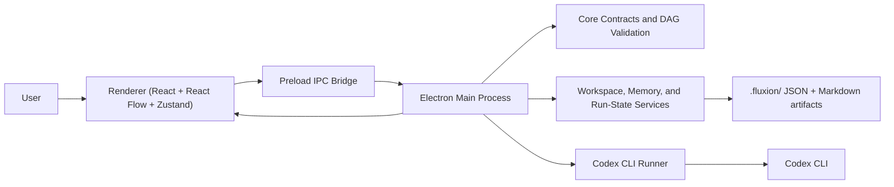

# Fluxion

Diagram-based desktop orchestration for Codex workflows on Windows.

Fluxion is an Electron desktop app that turns repeatable `codex exec` work into a visual workflow: author nodes on a canvas, connect them as a DAG, run them locally, stream logs in real time, and persist outputs inside the workspace.

## Overview

Fluxion exists to solve the gap between one-off terminal prompts and repeatable agent workflows.
Raw CLI sessions are hard to review, chain, retry, and preserve as project context. Fluxion gives that workflow a desktop shell with a graph editor, typed execution contracts, run persistence, and workspace-local memory files.

The project is aimed at:

- Developers who already use Codex CLI and want a reusable workflow instead of ad hoc terminal history
- Reviewers who need visible execution state, checkpoints, and persisted artifacts
- Teams working primarily on Windows and needing predictable path handling, process cleanup, and local workspace storage

Current source state, based on this repository:

- Codex CLI is the primary execution runtime
- Workflow files, run state, and memory artifacts are persisted locally under `.fluxion/`
- Auto and Manual execution modes are implemented
- Review checkpoints, retry from a node, and Windows-oriented packaging scripts are present
- Secondary provider support and "Explain with AI" diagnostics are still roadmap items, not the main execution path

## Features

### Workflow authoring

- React Flow canvas for building node-based agent workflows
- Drag-and-drop Codex agent palette
- Multi-workflow workspace library stored under `.fluxion/workflows`
- Per-node prompt, label, system instruction, model, and reasoning controls
- Auto and Manual execution modes at the workflow level
- Optional per-node human review checkpoints
- Artifact contracts through `requires` and `produces` fields

### Execution and runtime

- Real Codex CLI execution through a Windows-aware runner
- DAG validation and topological scheduling before execution
- Realtime stdout/stderr streaming into an in-app xterm.js terminal
- Abort flow with Windows process-tree cleanup
- Retry from a selected node and rerun of paused review nodes
- Codex readiness checks based on local CLI availability, login status, and model catalog discovery

### Workspace and persistence

- Workspace bootstrap under `.fluxion/`
- Context initialization modal that saves `.fluxion/context.json`
- Markdown memory pipeline with frontmatter under `.fluxion/memory`
- Persisted run state under `.fluxion/runs/<runId>.json`
- File watching for external workspace changes
- Legacy single-workflow compatibility for `.fluxion/workflow.json`

### Configuration and safety

- Typed shared contracts for workflow data, IPC payloads, and run state
- Secure Electron preload bridge via `contextBridge`
- Optional OpenAI API key storage in app user data, encrypted with Electron `safeStorage` when available
- Windows-first path handling and packaging conventions

## Tech Stack

### Frontend

- React 19
- TypeScript
- Vite via `electron-vite`
- Tailwind CSS v4
- Zustand
- React Flow (`@xyflow/react`)
- Lucide React
- xterm.js

### Backend

- Electron main process
- Node.js services and adapters
- `child_process` for CLI execution
- `chokidar` for workspace file watching
- `gray-matter` for Markdown + frontmatter
- `zod` for schemas and validation

### Database and persistence

- No database server
- Workflow, run, and memory data are stored as local JSON and Markdown files in the workspace
- App-level provider settings are stored in Electron user data

### Tooling and packaging

- ESLint
- Prettier
- Vitest
- TypeScript compiler
- electron-builder

## Installation

### Prerequisites

- Windows 10 or Windows 11
- Node.js and npm
- Codex CLI installed in the Windows PATH
- Codex CLI logged in before running workflows

Install and authenticate Codex CLI:

```powershell
npm install -g @openai/codex
codex login
codex login status
```

Clone and install the project:

```powershell
git clone <repository-url>
cd Fluxion
npm install
```

### Optional configuration

This repository does not currently include a required `.env` file or a built-in `.env` loader.

Optional OpenAI configuration is available for settings/capability flows and the unfinished OpenAI adapter:

```powershell
$env:OPENAI_API_KEY="your_api_key"
```

You can also configure the OpenAI API key from Fluxion's Global Settings dialog. In the current UI, Codex remains the active workflow runner.

## Usage

### Start development

```powershell
npm run dev
```

### Run quality checks

```powershell
npm run typecheck
npm test
npm run lint
```

### Build the app

```powershell
npm run build
npm run build:win
```

### Run the Windows smoke flow

```powershell
npm run smoke:win
```

The smoke script executes typecheck, tests, production build, and an unpacked Windows package build, then verifies that the generated executable and `app.asar` exist.

### Typical in-app workflow

1. Open a project folder.
2. Review and complete the workspace context modal.
3. Add one or more Codex nodes to the canvas.
4. Configure prompts, model selection, and optional review/artifact settings.
5. Save the workflow.
6. Run in `Auto` mode for continuous execution or `Manual` mode to pause every completed node for review.
7. Inspect terminal logs, output artifacts, and persisted memory files under `.fluxion/`.

## Project Structure

```text
Fluxion/
|-- build/                     # Packaging assets and platform-specific build resources
|-- docs/                      # Project assessments and backlog notes
|-- resources/                 # Application icons and bundled assets
|-- scripts/
|   `-- smoke/
|       `-- windows-build.mjs  # Windows packaging smoke script
|-- src/
|   |-- core/                  # Framework-agnostic workflow, DAG, artifact, and run-state contracts
|   |-- main/                  # Electron main process, runners, adapters, services, and IPC handlers
|   |-- preload/               # Secure renderer API exposed through contextBridge
|   |-- renderer/              # React UI, canvas, terminal, layout, and Zustand stores
|   `-- shared/                # Shared types, IPC payloads, model metadata, and workflow contracts
|-- electron-builder.yml       # Packaging configuration
|-- electron.vite.config.ts    # Electron + Vite build configuration
|-- eslint.config.mjs          # Lint configuration
|-- package.json               # Scripts and dependencies
|-- tsconfig*.json             # TypeScript project configuration
`-- vitest.config.ts           # Test configuration
```

## Configuration

### Workspace files created by Fluxion

```text
.fluxion/
|-- context.json
|-- workflow.json                  # Legacy single-workflow format
|-- workflows/
|   `-- *.fluxion.json             # Current multi-workflow format
|-- memory/
|   |-- global-context.md
|   |-- short-term/
|   `-- long-term/
`-- runs/
    `-- <runId>.json
```

### Important runtime settings

- `OPENAI_API_KEY`: optional; used for OpenAI settings/capability flows and the OpenAI adapter code path
- Global Settings dialog: can store the OpenAI API key in the app user-data directory
- `ELECTRON_RENDERER_URL`: used by `electron-vite` during development; not something you typically set manually

### Important project config files

- `electron.vite.config.ts`: aliases and renderer plugins
- `electron-builder.yml`: packaging targets and app metadata
- `eslint.config.mjs`: lint rules for TypeScript and React
- `vitest.config.ts`: test runner setup and aliases
- `tsconfig.node.json` and `tsconfig.web.json`: split TypeScript configs for Electron/node and renderer

## Architecture



### Execution flow

1. The renderer builds or edits a workflow graph.
2. The preload layer exposes typed IPC methods to the renderer.
3. The main process validates the workflow structure using `src/core`.
4. The workflow engine compiles context from global memory plus upstream node outputs.
5. The selected runner executes the node, currently centered on Codex CLI.
6. Logs stream back to the renderer while output artifacts and run state are persisted locally.
7. Review gates either continue automatically or pause for explicit approval, depending on workflow mode and node settings.

### Architectural boundaries

- `src/core` is intentionally framework-agnostic and testable without Electron or React.
- `src/main` owns process execution, filesystem persistence, provider discovery, and workflow orchestration.
- `src/preload` is the only direct bridge into Electron APIs for the renderer.
- `src/renderer` is a control surface for workflow editing, status visualization, and terminal inspection.
- `src/shared` keeps workflow shapes, IPC contracts, and provider metadata consistent across processes.

## Contributing

Contributions should preserve Fluxion's current direction: Windows-first, local-workspace orchestration, typed contracts, and non-blocking desktop UX.

Recommended workflow:

1. Open an issue or describe the problem clearly before large changes.
2. Create a focused branch for one feature or fix.
3. Keep workflow contracts, IPC payloads, and path handling type-safe and Windows-compatible.
4. Run the narrowest relevant verification before opening a pull request:

```powershell
npm run typecheck
npm test
npm run lint
```

5. For packaging or process changes, also run:

```powershell
npm run smoke:win
```

6. In the pull request, include the problem statement, the user-visible flows that changed, screenshots or recordings for UI changes, and any Codex CLI, workspace persistence, or Windows-specific validation notes.

## Roadmap

Based on the current source and backlog files, the next major areas are:

- "Explain with AI" diagnostics for failed nodes
- Real scout/source-scan context drafting instead of the current heuristic modal autofill
- Instruction-file generation with frontmatter for agent-specific handoff files
- Additional execution providers on the main workflow path beyond Codex
- Stronger CI coverage for Windows packaging and smoke validation
- Product hardening around retries, attempt lineage, and provider configuration

## License

This repository does not currently include a `LICENSE` file.

If the project is intended for open-source distribution, adding an MIT license would be a reasonable default.
