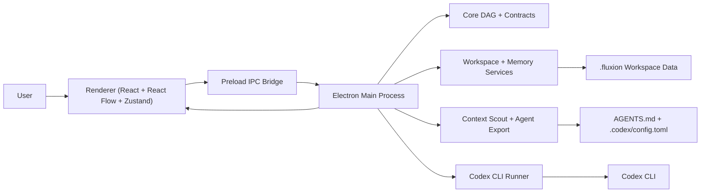

# Fluxion

Diagram-based desktop orchestration for Codex workflows on Windows.

Fluxion is an Electron desktop app that transforms repeatable `codex exec` workflows into a visual orchestration system: design DAG-based agent pipelines on a canvas, persist execution state locally, stream logs in real time, and standardize repository-level AI workflow setup.

The project is intentionally Windows-first and optimized around local workspaces, Codex CLI, and durable repository context.

---

# Why Fluxion Exists

Most Codex workflows today still live in:

* ad hoc terminal history
* temporary prompts
* disconnected markdown notes
* unrecoverable shell sessions
* manual retry chains

That makes review, collaboration, reproducibility, and long-running agent orchestration difficult.

Fluxion provides:

* a visual DAG editor for repeatable workflows
* persistent workspace-local execution state
* reusable project instructions and memory
* typed execution contracts between nodes
* review checkpoints and retry flows
* Codex-aware repository bootstrapping

Instead of treating Codex as a one-off terminal assistant, Fluxion treats it as a reusable execution runtime.

---

# Core Philosophy

Fluxion follows a repository-governed AI workflow model.

Project behavior should be:

* reproducible
* inspectable
* versionable
* workspace-scoped
* durable across sessions and contributors

Fluxion therefore encourages projects to keep AI workflow configuration directly inside the repository:

```text
.codex/config.toml
AGENTS.md
.github/codex/prompts/*.md
.fluxion/context.json
.fluxion/workflows/*.fluxion.json
```

The goal is to move AI workflows away from ephemeral terminal usage and toward structured, reviewable project infrastructure.

---

# Current Project Status

Based on the current repository implementation:

## Implemented

* Codex CLI runtime integration
* DAG workflow execution
* React Flow visual editor
* Manual and Auto execution modes
* Real-time terminal streaming
* Retry from node
* Human review checkpoints
* Workspace trust system
* Workspace scanning and context initialization
* AGENTS.md export flow
* Optional `.codex/config.toml` export
* Local run persistence
* Markdown memory pipeline
* Windows packaging and smoke validation
* Approval protocol guardrails

## In Progress / Roadmap

* Explain-with-AI diagnostics
* Additional execution providers
* Stronger CI and packaging automation
* Workflow lineage visualization
* Expanded agent-config exporters
* Better approval UX and remediation flows

---

# Recommended Fluxion + Codex Workspace Structure

Fluxion works best when the repository itself contains durable AI workflow infrastructure.

```text
project/
|-- .codex/
|   `-- config.toml
|-- .github/
|   `-- codex/
|       `-- prompts/
|           |-- brainstorm.md
|           |-- planning.md
|           |-- implement.md
|           `-- review.md
|-- .fluxion/
|   |-- context.json
|   |-- workflows/
|   |   `-- *.fluxion.json
|   |-- memory/
|   `-- runs/
|-- AGENTS.md
`-- src/
```

This structure keeps:

* repository instructions durable
* prompts reusable
* execution reproducible
* workflows reviewable
* Codex behavior consistent across contributors

---

# Features

## Workflow Authoring

* React Flow canvas for node-based orchestration
* Drag-and-drop Codex agent palette
* DAG-based execution graph
* Multi-workflow workspace library
* Node-level prompt and system instruction controls
* Per-node model and reasoning configuration
* Auto and Manual execution modes
* Human review checkpoints
* Artifact contracts using `requires` and `produces`

## Runtime and Execution

* Native Codex CLI execution
* Windows-aware process management
* DAG validation and topological scheduling
* Realtime stdout/stderr streaming
* xterm.js terminal integration
* Retry from selected node
* Paused review-node reruns
* Approval protocol guardrails
* Readiness checks for:

  * Codex installation
  * authentication state
  * model availability
  * permission configuration

## Workspace and Persistence

* Workspace trust verification
* Recent workspace reopening
* `.fluxion/` workspace bootstrap
* Context scanning and initialization
* Source evidence tracking
* Command and path discovery
* Persisted run state
* Markdown memory pipeline
* External workspace file watching
* Legacy workflow compatibility
* AGENTS.md export flow
* Optional `.codex/config.toml` generation

## Safety and Contracts

* Typed IPC contracts
* Typed workflow schemas
* Secure Electron preload bridge
* Windows-safe path handling
* Optional encrypted API-key storage via Electron `safeStorage`

---

# Tech Stack

## Frontend

* React 19
* TypeScript
* Tailwind CSS v4
* React Flow (`@xyflow/react`)
* Zustand
* Lucide React
* xterm.js
* Vite via `electron-vite`

## Desktop Runtime

* Electron
* Node.js
* `child_process`
* `chokidar`
* `gray-matter`
* `zod`

## Persistence

Fluxion intentionally avoids a database server.

All workflow state is stored locally inside the workspace:

* JSON workflow definitions
* JSON run state
* Markdown memory artifacts
* project-level Codex config files

---

# Installation

## Prerequisites

### Required

* Windows 10 or Windows 11
* Node.js 20+
* npm
* Git
* Codex CLI

### Recommended

* VS Code
* Codex IDE extension
* PowerShell 7+

---

## 1. Install Codex CLI

```powershell
npm install -g @openai/codex
```

Authenticate:

```powershell
codex login
codex login status
```

Useful references:

* [https://developers.openai.com/codex/config-reference#configtoml](https://developers.openai.com/codex/config-reference#configtoml)
* [https://developers.openai.com/codex/ide#extension-setup](https://developers.openai.com/codex/ide#extension-setup)
* [https://developers.openai.com/codex/cli/slash-commands#built-in-slash-commands](https://developers.openai.com/codex/cli/slash-commands#built-in-slash-commands)

---

## 2. Clone Fluxion

```powershell
git clone <repository-url>
cd Fluxion
npm install
```

---

## 3. Start Development

```powershell
npm run dev
```

---

# First-Time Workspace Setup

Fluxion is designed around trusted repository-local setup.

Recommended first-run flow:

## Step 1 — Open a Workspace

Open an existing repository or create a new project folder.

Fluxion will:

* verify workspace trust
* initialize `.fluxion/`
* detect Codex readiness
* scan repository context

---

## Step 2 — Review Context Scan

The context initializer scans for:

* package managers
* build commands
* test commands
* important source folders
* existing AI instruction files
* repository metadata

Detected information is persisted into:

```text
.fluxion/context.json
```

---

## Step 3 — Export Durable Project Instructions

Fluxion can generate:

```text
AGENTS.md
.codex/config.toml
```

These files allow Codex behavior to remain:

* reproducible
* repository-scoped
* reviewable
* durable across sessions

---

## Step 4 — Create Workflow DAGs

Workflows are stored under:

```text
.fluxion/workflows/
```

Each workflow is a reusable executable DAG.

---

## Step 5 — Execute and Review

Run workflows in:

* `Auto` mode for continuous execution
* `Manual` mode for gated review-driven execution

Artifacts, logs, and memory persist locally.

---

# Example Workspace Layout

```text
.fluxion/
|-- context.json
|-- workflows/
|   `-- feature-implementation.fluxion.json
|-- memory/
|   |-- global-context.md
|   |-- short-term/
|   `-- long-term/
`-- runs/
    `-- <runId>.json
```

Additional generated project files:

```text
AGENTS.md
.codex/
`-- config.toml
```

---

# Usage

## Development Commands

### Start Development

```powershell
npm run dev
```

### Typecheck

```powershell
npm run typecheck
```

### Tests

```powershell
npm test
```

### Lint

```powershell
npm run lint
```

### Production Build

```powershell
npm run build
npm run build:win
```

### Windows Smoke Validation

```powershell
npm run smoke:win
```

The smoke flow validates:

* type safety
* tests
* production builds
* unpacked Windows packaging
* executable generation
* `app.asar` creation

---

# Typical Workflow Lifecycle

1. Open a workspace
2. Trust the workspace
3. Review context scan results
4. Export AGENTS.md and optional Codex config
5. Build a DAG visually
6. Configure prompts and permissions
7. Save the workflow
8. Execute nodes through Codex CLI
9. Review logs and artifacts
10. Retry failed nodes when necessary
11. Persist outputs into `.fluxion/`

---

# Architecture



---

# Architectural Boundaries

## `src/core`

Framework-agnostic workflow contracts and DAG logic.

## `src/main`

Electron orchestration, persistence, runners, filesystem access, and process execution.

## `src/preload`

Secure IPC bridge exposed through Electron `contextBridge`.

## `src/renderer`

React UI, workflow editing surface, terminal inspection, and state visualization.

## `src/shared`

Shared workflow contracts, IPC payloads, schemas, and metadata.

---

# Project Structure

```text
Fluxion/
|-- build/
|-- docs/
|-- resources/
|-- scripts/
|   `-- smoke/
|-- src/
|   |-- core/
|   |-- main/
|   |-- preload/
|   |-- renderer/
|   `-- shared/
|-- electron-builder.yml
|-- electron.vite.config.ts
|-- eslint.config.mjs
|-- package.json
|-- tsconfig*.json
`-- vitest.config.ts
```

---

# Recommended Repository Practices

Fluxion is most effective when repositories:

* keep AI instructions version-controlled
* store reusable prompts in `.github/codex/prompts/`
* use durable AGENTS.md guidance
* avoid prompt-only workflows
* treat workflows as executable infrastructure
* preserve review checkpoints for important changes

---

# Contributing

Contributions should preserve Fluxion's core direction:

* Windows-first desktop orchestration
* local-workspace persistence
* typed execution contracts
* reproducible Codex workflows
* non-blocking desktop UX

Recommended contributor flow:

1. Open an issue before large changes
2. Keep changes narrowly scoped
3. Preserve Windows-safe path handling
4. Maintain type-safe IPC contracts
5. Run relevant verification before PRs

Verification:

```powershell
npm run typecheck
npm test
npm run lint
```

For packaging/process changes:

```powershell
npm run smoke:win
```

Pull requests should include:

* problem statement
* affected user flows
* screenshots/videos for UI changes
* Codex/runtime implications
* Windows-specific validation notes

---

# Troubleshooting

## Codex CLI Not Found

Verify installation:

```powershell
codex --version
```

Ensure the Codex binary exists in the Windows PATH.

---

## Codex Authentication Issues

Reauthenticate:

```powershell
codex login
codex login status
```

---

## Workflow Execution Blocked

Fluxion may block execution if:

* approval settings are unsafe
* workspace trust is missing
* Codex readiness checks fail
* required models are unavailable

Review the readiness panel and permission prompts.

---

## Packaging Failures

Run:

```powershell
npm run smoke:win
```

before reporting Windows packaging issues.

---

# Roadmap

Major next directions:

* Explain-with-AI node diagnostics
* Additional execution providers
* Better lineage and retry visualization
* Expanded workflow templates
* CI hardening for packaging validation
* Richer approval protocol UX
* Multi-agent orchestration improvements

---

# License

This repository does not currently include a `LICENSE` file.

If the project is intended for open-source distribution, adding an MIT license would be a reasonable default.
