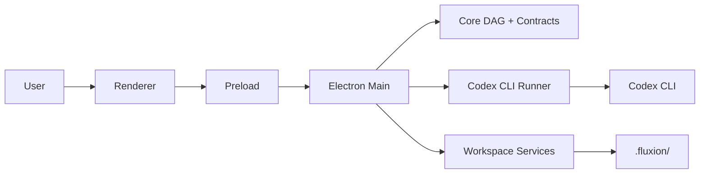

# Fluxion

Windows-first Electron desktop app for designing and running Codex workflows as visual DAGs.

Fluxion turns repeatable `codex exec` work into a local orchestration system with review checkpoints, run logs, workspace-scoped artifacts, and durable repository guidance.

## What It Does

- Design multi-step Codex workflows on a canvas
- Run workflows locally through the Codex CLI
- Persist workflow state and run history under `.fluxion/`
- Stream terminal output and node status in real time
- Gate execution with human review checkpoints
- Inspect effective Codex config, MCP readiness, and workflow policy posture
- Track context pressure, compaction hints, stale retry carry-over, and long-term summary reuse before reruns
- Create long-term memory summaries directly from compaction warnings in the Flow Context inspector and from retry/review-adjacent runtime surfaces
- Jump from runtime failures or review checkpoints into Windows Terminal repro sessions, including split-pane debug layouts
- Export repository guidance such as `AGENTS.md` and optional `.codex/config.toml`

## Product Direction

- Windows-first
- Local-workspace persistence
- Codex CLI as the primary runtime
- Typed workflow and IPC contracts
- Non-blocking desktop UX

The unfinished OpenAI adapter exists in the codebase, but it is not the main product path.

## Repository Guide

- [AGENTS.md](./AGENTS.md): durable instructions for Codex working in this repo
- [ARCHITECTURE.md](./ARCHITECTURE.md): current architecture, runtime boundaries, persistence, and execution model
- [DESIGN.md](./DESIGN.md): visual and UX direction
- [docs/agents/README.md](./docs/agents/README.md): agent-facing documentation map for this repository
- [docs/backlog/backlog.md](./docs/backlog/backlog.md): tracked work and open items

## Repository Layout

```text
src/core       framework-agnostic workflow, DAG, artifact, and run-state logic
src/main       Electron main process, IPC handlers, services, runners, adapters
src/preload    typed contextBridge API exposed to the renderer
src/renderer   React UI, React Flow canvas, Zustand stores, dialogs, terminal view
src/shared     shared workflow, provider, and IPC contracts
docs/          backlog, QA, runtime notes, agent docs, and dogfood assets
scripts/       smoke and project scripts
```

## Local Persistence

Fluxion keeps project state inside the opened workspace:

```text
.fluxion/context.json
.fluxion/workflows/*.fluxion.json
.fluxion/workflow.json
.fluxion/memory/**/*.md
.fluxion/runs/*.json
```

This is part of the product contract. Do not change these shapes casually.

## Prerequisites

- Windows 10 or Windows 11
- Node.js 20+
- npm or pnpm
- Git
- Codex CLI

Recommended:

- PowerShell 7+
- VS Code
- Codex IDE extension

## Setup

```powershell
npm install
npm run dev
```

Install and authenticate Codex CLI if needed:

```powershell
npm install -g @openai/codex
codex login
codex login status
```

## Commands

```powershell
npm run dev
npm run typecheck
npm test
npm run lint
npm run build
npm run build:win
npm run smoke:win
```

## Verification Expectations

- Type or contract changes: `npm run typecheck`
- Behavior changes: `npm test`
- Lint-sensitive edits: `npm run lint`
- Build or packaging changes: `npm run build` and, when relevant, `npm run smoke:win`

## Typical Workflow

1. Open a repository workspace
2. Trust the workspace
3. Review the generated context
4. Export or update `AGENTS.md` and optional `.codex/config.toml`
5. Create or edit a workflow DAG
6. Run through the Codex CLI
7. Review outputs, logs, and checkpoints
8. Retry failed nodes when needed
9. Use policy/context inspectors, MCP dependency warnings, long-term memory summaries, and Windows Terminal repro sessions when diagnosing reruns

## Architecture Summary



See [ARCHITECTURE.md](./ARCHITECTURE.md) for the detailed runtime model.

## Related Docs

- [docs/agents/README.md](./docs/agents/README.md)
- [docs/runtime/](./docs/runtime/): implementation notes and ADR-style runtime documents; useful, but not canonical unless linked from `AGENTS.md`, `README.md`, or `ARCHITECTURE.md`
- [docs/runtime/codex-approval-status.md](./docs/runtime/codex-approval-status.md)
- [docs/dogfood/README.md](./docs/dogfood/README.md)
- [docs/qa/context-init-smoke.md](./docs/qa/context-init-smoke.md)

