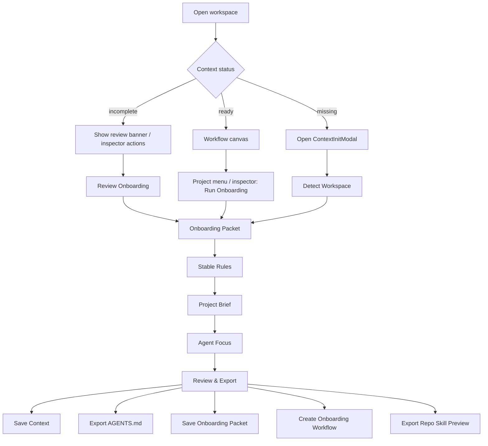
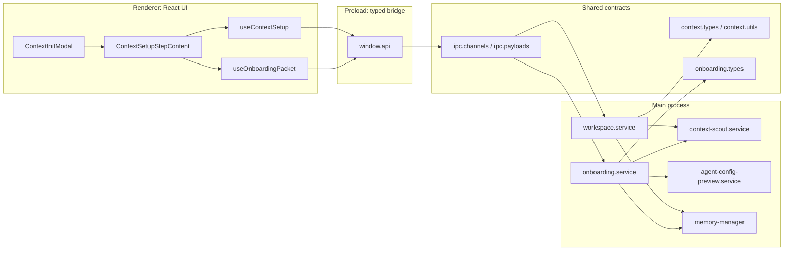
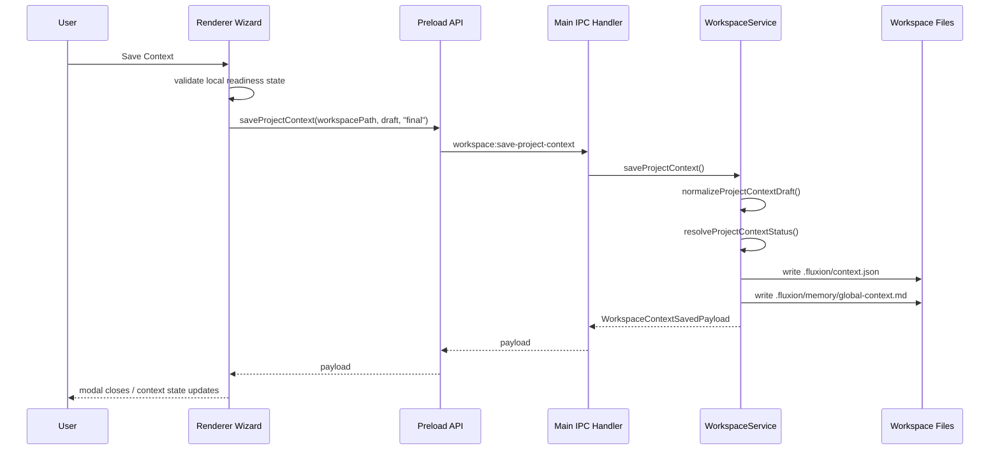
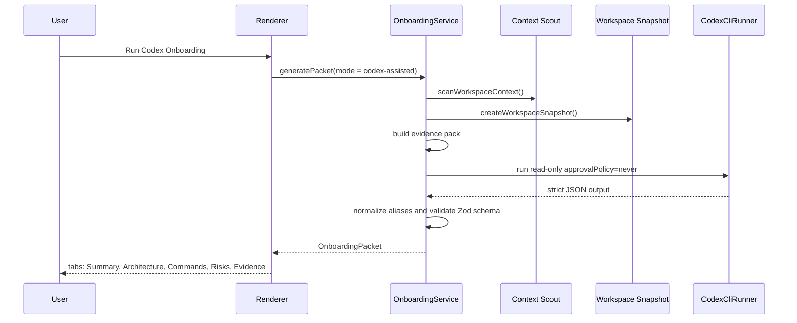

# Fluxion Context Init Technical Report

Date: 2026-05-10  
Status: P2 hardened; ready for P2.5 acceptance smoke
Scope: Context initialization, onboarding packet generation, context persistence, and export actions  
Audience: Tech Lead, UX/UI Lead, Solution Architecture Office

## Executive Summary

Context Init is the workspace onboarding layer that converts a raw repository folder into durable
runtime context for Fluxion workflows. The current design is a native Fluxion flow, not a global
Codex skill installation. It performs deterministic repository scanning first, allows an explicit
read-only Codex-assisted packet step, and saves compact runtime context to workspace-local files.

The implementation is aligned with Fluxion's architecture boundaries:

- `src/shared` owns typed contracts, schemas, and IPC payloads.
- `src/main` owns filesystem access, workspace scanning, Codex execution, artifact generation, and
  persistence.
- `src/preload` exposes a thin typed bridge.
- `src/renderer` owns the wizard UI, previews, and user-driven artifact actions.

The flow is designed for three review concerns:

- Tech Lead: typed contracts, validation, testability, process isolation, and maintainability.
- UX/UI Lead: evidence-first wizard, explicit progress, compact panels, readable previews, and
  reversible actions.
- Solution Architecture Office: workspace-scoped artifacts, traceability, security posture, and
  architecture decision rationale.

## External Report And Review Method

This report follows a technical-report structure: summary, investigation scope, system design,
evidence, risks, recommendations, and references. That structure is adapted from university
technical-report guidance that treats the summary as decision-oriented, keeps the body organized
for the reader's needs, and separates results from recommendations.

Reference principles used:

- University of Melbourne technical-report guidance: use a self-contained summary, explain the
  investigation, and structure the report body around reader needs.
- MIT Communication Lab / Broad Institute figure-design guidance: every diagram or visual should
  communicate a clear message and include only evidence that supports that message.
- Stanford usability principles: evaluate the UI against control, recognition over recall, clarity,
  simplicity, error prevention, consistency, feedback, and accessibility.
- CMU Software Engineering Institute ATAM guidance: evaluate architecture against quality
  attributes, risks, non-risks, sensitivity points, and tradeoffs.
- Cornell Engineering Communications guidance: technical documentation should adapt to stakeholder
  needs and support clear engineering communication deliverables.

## Problem Statement

Fluxion runs Codex-based workflows against local repositories. Without a durable context-init flow,
agents receive incomplete or stale assumptions, users repeat setup instructions manually, and
workspace artifacts such as `.fluxion/context.json`, `AGENTS.md`, and memory files drift apart.

Context Init solves this by:

- detecting repository signals before asking users to write context manually;
- keeping source evidence attached to generated context;
- distinguishing compact runtime context from longer onboarding evidence;
- allowing users to preview and approve artifacts before writing them;
- keeping repository-local state under `.fluxion/` and optional repo-local `.agents/`.

## Goals And Non-Goals

### Goals

- Produce a durable `ProjectContextDraft` that can be passed to agents and workflows.
- Persist context in both machine-readable and human-readable forms.
- Make context setup usable for blank projects and existing repositories.
- Preserve uncertainty through open questions instead of forcing guesses.
- Generate an optional evidence-backed onboarding packet.
- Keep all writes explicit and workspace-scoped.
- Support AGENTS export and repo-local onboarding skill export as opt-in artifacts.

### Non-Goals

- No global Codex skill installation.
- No automatic source-file writes from onboarding.
- No embeddings, vector database, or semantic index in v1.
- No renderer-side filesystem scanning or process execution.
- No replacement of `.fluxion/context.json` with the longer onboarding packet.

## Current User Journey



## Wizard UX Specification

| Step              | Purpose                                                         | Primary Inputs                                                        | Primary Output                                                  |
| ----------------- | --------------------------------------------------------------- | --------------------------------------------------------------------- | --------------------------------------------------------------- |
| Detect Workspace  | Show deterministic repository signals before manual editing.    | Workspace scan, existing context, trust status.                       | Draft fields, stack signals, scanned files, warnings.           |
| Onboarding Packet | Create evidence-backed packet from scan or explicit Codex pass. | Scan result, draft, Codex readiness.                                  | `OnboardingPacket`, suggestions, diagnostics, artifact actions. |
| Stable Rules      | Capture durable project rules and verification commands.        | Stack, languages, frameworks, package managers, commands.             | Stable rules and verification context.                          |
| Project Brief     | Capture product intent.                                         | Goal, target users, first milestone, architecture summary, non-goals. | Product brief fields.                                           |
| Agent Focus       | Scope agent behavior.                                           | Important paths, focus areas, open questions.                         | Agent working boundaries.                                       |
| Review & Export   | Preview and approve final artifacts.                            | Draft context, enrichment suggestions, exporter previews.             | Saved context and optional repository artifacts.                |

Recent Step 4 layout updates:

- The `Project Brief` screen uses a responsive two-column grid on desktop.
- Textarea heights are synchronized through a shared `BRIEF_TEXTAREA_ROWS` constant.
- The modal uses `max-h-[calc(100vh-40px)]`, reducing accidental footer overlap.
- The scrollable content area keeps bottom padding so final controls do not obscure fields.

## Architecture Overview



## Key Contracts

### `ProjectContextDraft`

Location: `src/shared/context.types.ts`  
Version: `PROJECT_CONTEXT_VERSION = "2.0"`

Important field groups:

- Identity: `workspaceType`, `projectName`, `contextStatus`, `lastReviewedAt`.
- Product intent: `projectGoal`, `targetUsers`, `architectureSummary`, `firstMilestone`.
- Stack: `primaryStack`, `languages`, `frameworks`, `packageManagers`, `buildSystems`,
  `testFrameworks`.
- Agent behavior: `stableRules`, `verificationCommands`, `importantPaths`, `focusAreas`,
  `nonGoals`, `openQuestions`.
- Architecture evidence: `components`, `commandCatalog`, `entrypoints`, `moduleBoundaries`,
  `sourceEvidence`.
- Safety: `workspaceTrust`, `securityPolicy`, `generatedOrIgnoredPaths`, `riskFlags`.
- UX state: `contextOnboarding`.

Final-save readiness rules:

- All projects require `projectName` and `projectGoal`.
- Blank projects additionally require `firstMilestone`, `kickoffIntent`, and at least one target
  stack signal.
- Existing repositories require stack/language signal, architecture or important path signal, and
  verification command or verification risk flag.

### `OnboardingPacket`

Location: `src/shared/onboarding.types.ts`  
Version: `ONBOARDING_PACKET_VERSION = "1.0"`

The packet is intentionally larger than `.fluxion/context.json` and is stored separately. It
contains:

- `projectSummary`
- `stack`
- `components`
- `architectureMap`
- `commands`
- `risks`
- `openQuestions`
- `suggestedContextPatch`
- `suggestedStableRules`
- `artifactRecommendations`
- `sourceEvidence`
- `diagnostics`

Zod validation is strict for packet shape. Command category and risk values are normalized before
packet validation to tolerate likely Codex wording variants such as `verification` or `low`.

## IPC Surface

| Channel                                          | Owner | Purpose                                                      |
| ------------------------------------------------ | ----- | ------------------------------------------------------------ |
| `workspace:scan-context`                         | Main  | Run deterministic context scan.                              |
| `workspace:get-context`                          | Main  | Read existing `.fluxion/context.json` or map legacy context. |
| `workspace:save-project-context`                 | Main  | Save draft/final/skipped context.                            |
| `workspace:enrich-context`                       | Main  | Generate Codex-assisted context suggestions.                 |
| `workspace:generate-onboarding-packet`           | Main  | Generate deterministic or Codex-assisted packet.             |
| `workspace:save-onboarding-packet`               | Main  | Save packet markdown into long-term memory.                  |
| `workspace:create-onboarding-workflow`           | Main  | Create read-only onboarding DAG workflow.                    |
| `workspace:create-repo-onboarding-skill-preview` | Main  | Preview repo-local skill operations.                         |
| `workspace:apply-repo-onboarding-skill-preview`  | Main  | Apply previously previewed repo-local skill writes.          |
| `agent-config:create-preview`                    | Main  | Preview AGENTS/config exports.                               |
| `agent-config:apply-preview`                     | Main  | Apply approved export operations.                            |

## Persistence Model

| Artifact              | Path                                                | Writer                                   | Purpose                                         |
| --------------------- | --------------------------------------------------- | ---------------------------------------- | ----------------------------------------------- |
| Runtime context       | `.fluxion/context.json`                             | `workspace.service`                      | Structured context for Fluxion.                 |
| Global memory context | `.fluxion/memory/global-context.md`                 | `workspace.service`                      | Human-readable context injected into workflows. |
| Onboarding packet     | `.fluxion/memory/long-term/onboarding.md`           | `onboarding.service`                     | Detailed evidence and diagnostics.              |
| Onboarding workflow   | `.fluxion/workflows/codex-onboarding*.fluxion.json` | `onboarding.service`                     | Repeatable read-only onboarding DAG.            |
| Codex instructions    | `AGENTS.md`                                         | agent-config exporter                    | Compact Codex project instructions.             |
| Repo-local skill      | `.agents/skills/fluxion-onboarding/`                | `onboarding.service` after preview apply | Optional local skill artifact.                  |

The compact context is the runtime source of truth. The packet is supporting evidence and should not
be embedded wholesale into `AGENTS.md` or `.fluxion/context.json`.

## Sequence: Final Context Save



## Sequence: Codex-Assisted Onboarding Packet



## Evidence Collection Rules

`onboarding.service` builds an evidence pack from prioritized repository files, scan output, draft
important paths, entrypoints, module boundaries, and existing agent instruction sources.

Hard limits:

- `MAX_EVIDENCE_FILES = 16`
- `MAX_FILE_BYTES = 14 KiB`
- `MAX_TOTAL_TEXT_BYTES = 80 KiB`

Sensitive or noisy paths are excluded:

- `.env`, `.env.*`
- names containing `secret`, `credential`, `private-key`
- `.pem`, `.key`, `id_rsa`
- `vendor`, `node_modules`, `dist`, `build`, `coverage`

This keeps Codex-assisted onboarding bounded and lowers accidental secret exposure.

## Safety And Security Posture

| Concern            | Current Control                                                                  | Residual Risk                                                           |
| ------------------ | -------------------------------------------------------------------------------- | ----------------------------------------------------------------------- |
| Secret exposure    | Evidence whitelist plus sensitive/generated/vendor exclusions.                   | Secret-like files with unusual names may still need detector expansion. |
| Source writes      | Packet generation is read-only; artifacts require explicit preview/apply.        | Users can still apply generated repo-local artifacts intentionally.     |
| Codex permissions  | Codex-assisted packet uses `sandboxMode: read-only` and `approvalPolicy: never`. | Runner behavior depends on local Codex CLI honoring these settings.     |
| Workspace boundary | Repo-local skill apply asserts writes stay inside workspace.                     | Symlink and realpath handling should remain part of security review.    |
| Context bloat      | Long packet is stored in long-term memory, compact context remains short.        | Users may overfill manual fields unless UI guidance remains concise.    |
| Schema drift       | Shared Zod schemas validate packet contracts.                                    | Renderer component tests should cover future field rearrangements.      |

## UX Review Notes

The wizard follows an evidence-first pattern:

- It shows detected facts before asking users to write project context.
- It exposes uncertainty through open questions.
- It shows status chips for readiness, generation mode, file counts, and truncation.
- It keeps actions explicit: build, run, apply suggestions, save packet, create workflow, preview
  repo skill, apply repo skill.
- It keeps destructive or write-like operations behind preview/apply actions.

UX heuristics mapped to implementation:

| Heuristic               | Implementation                                                                                 |
| ----------------------- | ---------------------------------------------------------------------------------------------- |
| User control            | Step navigation is manual; users choose when to run Codex and when to save.                    |
| Recognition over recall | Scan data, suggestions, and previews are visible in the wizard.                                |
| Clarity                 | Footer exposes `Save Draft`, `Save Context`, and `Next`; review step states missing fields.    |
| Error prevention        | `Save Context` is disabled until final-save requirements are met.                              |
| Feedback                | Onboarding progress states are `Reading`, `Mapping`, `Reviewing`, and `Done`.                  |
| Consistency             | Reuses Fluxion controls: status chips, compact panels, mono paths, hairline borders.           |
| Accessibility           | Modal has focus trap and dialog semantics; further keyboard regression testing is recommended. |

## Architecture Quality Attributes

| Quality Attribute | Scenario                                                       | Current Assessment                                                                                     |
| ----------------- | -------------------------------------------------------------- | ------------------------------------------------------------------------------------------------------ |
| Modifiability     | Add a new context field or artifact action.                    | Good if shared contracts are updated first, then preload/main/renderer.                                |
| Safety            | User runs Codex-assisted onboarding in a sensitive repository. | Bounded by read-only execution, evidence limits, and path exclusions.                                  |
| Traceability      | Reviewer asks why a context field was suggested.               | Packet and `sourceEvidence` preserve file paths, confidence, notes, and diagnostics.                   |
| Usability         | First-time user opens a repo without context.                  | Modal opens automatically for missing context and starts with detected evidence.                       |
| Reliability       | Codex returns malformed JSON.                                  | Service returns clear parse/schema errors; enum aliases are normalized.                                |
| Portability       | Runs on Windows workspaces.                                    | Uses `path.join`, `path.resolve`, Electron IPC, and Windows-safe conventions.                          |
| Performance       | Large repository opened.                                       | Snapshot/evidence pack uses fixed byte and file-count caps; scan still needs ongoing fixture coverage. |

## Implementation Inventory

### Shared

- `src/shared/context.types.ts`
- `src/shared/context.utils.ts`
- `src/shared/onboarding.types.ts`
- `src/shared/ipc.channels.ts`
- `src/shared/ipc.payloads.ts`

### Main

- `src/main/services/workspace.service.ts`
- `src/main/services/context-scout.service.ts`
- `src/main/services/context-enrichment.service.ts`
- `src/main/services/onboarding.service.ts`
- `src/main/services/agent-config/*`
- `src/main/ipc/workflow.handlers.ts`

### Preload

- `src/preload/index.ts`
- `src/preload/index.d.ts`

### Renderer

- `src/renderer/src/features/project-context/setup/ContextInitModal.tsx`
- `src/renderer/src/features/project-context/setup/hooks/useContextSetup.ts`
- `src/renderer/src/features/project-context/setup/hooks/useOnboardingPacket.ts`
- `src/renderer/src/features/project-context/setup/components/*`
- `src/renderer/src/features/project-context/inspector/ProjectContextInspector.tsx`
- `src/renderer/src/features/topbar/components/ProjectMenu.tsx`
- `src/renderer/src/features/workflow-editor/canvas/FlowCanvas.tsx`

## Test Coverage And Verification

Current automated coverage includes:

- `src/main/test/context-scout.service.test.ts`
  - Blank, existing, Java, monorepo, and instruction-source detection.
- `src/main/test/workspace-context.test.ts`
  - `.fluxion/context.json` and `global-context.md` writes.
  - Legacy context mapping.
  - Context onboarding metadata upsert/patch.
  - Legacy workflow migration.
- `src/main/test/onboarding.service.test.ts`
  - Deterministic packets for Node, Python, Java, and monorepo fixtures.
  - Secret exclusion.
  - Codex read-only non-interactive execution.
  - Codex enum alias normalization.
  - Non-JSON error handling.
  - Packet save, workflow creation, repo-local skill preview.
- `src/shared/context.utils.test.ts`
  - Final-save readiness.
  - Skipped/incomplete draft behavior.
  - Markdown rendering.
  - Onboarding metadata hiding from markdown.
- `src/shared/onboarding.types.test.ts`
  - Packet schema validation.
- `src/renderer/src/features/project-context/setup/lib/*.test.ts`
  - Enrichment and onboarding patch logic.

P1/P2 hardening verification completed before this report update:

- `npm run typecheck`
- `npm test`
- Targeted ESLint for touched Context Init/onboarding files
- `npm run build`
- `npm audit --audit-level=high`

P2.5 adds a manual acceptance checklist at `docs/qa/context-init-smoke.md` and includes Context Init
in the internal alpha smoke gate.

Recommended additional coverage:

- Renderer component tests for wizard step transitions and disabled/enabled footer actions.
- Screenshot regression for `Project Brief` at desktop and compact heights.
- Keyboard-only modal traversal and focus-return tests.
- Security fixture for symlinked evidence paths if workspace snapshot follows symlinks.
- Full E2E smoke for deterministic packet, Save Context, Save Packet, and Create Workflow in a
  disposable workspace.

## Acceptance Matrix

| Reviewer   | Acceptance Criteria                                                          | Evidence                                                                      |
| ---------- | ---------------------------------------------------------------------------- | ----------------------------------------------------------------------------- |
| Tech Lead  | Shared contracts are typed, validated, and updated before IPC/UI.            | `context.types.ts`, `onboarding.types.ts`, `ipc.channels.ts`.                 |
| Tech Lead  | Long-running scan/Codex work remains outside renderer.                       | `workspace.service`, `onboarding.service`, IPC handlers.                      |
| Tech Lead  | Context writes are atomic enough for current alpha scope.                    | `writeProjectContextFiles()` writes JSON and markdown together.               |
| UX/UI Lead | Wizard is evidence-first and does not require recall-heavy setup.            | Detect step and packet previews expose scan facts.                            |
| UX/UI Lead | Step 4 controls fit and have balanced textarea heights.                      | `ContextSetupBriefStep.tsx` shared textarea row constant and responsive grid. |
| UX/UI Lead | Review step clearly distinguishes draft/final/export actions.                | Footer actions and review panels.                                             |
| SA Office  | Context artifacts are workspace-scoped and versionable.                      | `.fluxion/` and optional `.agents/` paths.                                    |
| SA Office  | Security controls prevent implicit source writes and reduce secret exposure. | Read-only Codex, preview/apply artifacts, evidence exclusions.                |
| SA Office  | Architecture decisions and risks are documented.                             | This report, source evidence, packet diagnostics, test coverage.              |

## Open Risks And Recommendations

| Priority | Risk                                                                    | Recommendation                                                                      |
| -------- | ----------------------------------------------------------------------- | ----------------------------------------------------------------------------------- |
| P1       | Manual desktop smoke still needs a repeatable record.                   | Use `docs/qa/context-init-smoke.md` during internal alpha release checks.           |
| P1       | WindowsApps/App Execution Alias can look like a broken Codex install.   | Add a dedicated readiness code and setup copy for alias-blocked candidates.         |
| P2       | Renderer layout regressions can recur without screenshot tests.         | Add Playwright or equivalent screenshot checks for Context Init modal.              |
| P2       | Evidence exclusion relies on filename/path heuristics.                  | Continue expanding sensitive-path fixtures as new naming patterns appear.           |
| P2       | Codex-assisted onboarding depends on local Codex CLI behavior.          | Keep deterministic packet path as default fallback and expose readiness clearly.    |
| P3       | Large-repository scan performance has not been benchmarked.             | Add benchmark notes before introducing bounded parallel scan.                       |

## Refactor And Improvement Roadmap

The current implementation is already split across `context-scout.service.ts`,
`onboarding.service.ts`, `workspace.service.ts`, shared schemas, preload APIs, and renderer wizard
components. The remaining refactor should therefore avoid a generic `contextInit` rewrite and focus
on making each existing unit smaller, more observable, and easier to test.

### Current Alignment Against Recommendations

| Recommendation                                        | Current State                                                                                                      | Next Action                                                                                          |
| ----------------------------------------------------- | ------------------------------------------------------------------------------------------------------------------ | ---------------------------------------------------------------------------------------------------- |
| Separate scanning, packet building, and orchestration | Scanner exists in `context-scout.service.ts`; packet helpers are still mostly internal to `onboarding.service.ts`. | Extract packet builder, evidence collector, and Codex output parser into focused modules.            |
| Add detailed error handling and logging               | User-facing errors exist; structured diagnostic logging is limited.                                                | Add scoped logger calls around scan, evidence collection, Codex execution, parsing, and file writes. |
| Improve large-repository performance                  | Evidence pack has file and byte caps; scanner has deterministic exclusions.                                        | Introduce bounded concurrency in snapshot/scanner internals after benchmark tests.                   |
| Normalize IO and paths                                | Code uses `path.resolve`, `path.join`, and relative path guards.                                                   | Centralize path normalization and sensitive-path matching in a shared main-process utility.          |
| Relax strict schema safely                            | Packet schema is strict; command category/risk aliases are normalized.                                             | Add transform helpers for casing and common synonyms while preserving final canonical values.        |
| Strengthen tests                                      | Main and shared tests cover scan, save, packets, and schema validation.                                            | Add renderer component and E2E smoke coverage for the whole init flow.                               |
| Default read-only and harden file access              | Codex onboarding uses read-only + `approvalPolicy: never`; writes are preview/apply.                               | Add symlink and realpath security fixtures for write/apply paths.                                    |
| Increase configuration flexibility                    | Limits are constants inside services.                                                                              | Move evidence limits and timeout defaults to a small typed config module.                            |
| Dependency security review                            | Dependency versions are managed by npm and lockfile.                                                               | Run `npm audit` or project-approved security scan before release gates.                              |
| Documentation and README examples                     | This technical report documents the flow.                                                                          | Link this report from README or an architecture index when Context Init is considered stable.        |

### Refactor Target Shape

Recommended module split inside `src/main/services/onboarding/`:

```text
src/main/services/onboarding/
|-- onboarding-orchestrator.ts
|-- onboarding-evidence-collector.ts
|-- onboarding-packet-builder.ts
|-- onboarding-codex-parser.ts
|-- onboarding-artifact-writer.ts
`-- onboarding-config.ts
```

Responsibilities:

- `onboarding-orchestrator.ts`: coordinates scan, evidence collection, deterministic packet build,
  optional Codex run, and artifact actions.
- `onboarding-evidence-collector.ts`: owns candidate path selection, sensitive-path exclusion,
  file caps, truncation, and diagnostics.
- `onboarding-packet-builder.ts`: builds deterministic packets from normalized scan and draft data.
- `onboarding-codex-parser.ts`: extracts JSON, normalizes aliases, validates Zod schema, and returns
  diagnostics.
- `onboarding-artifact-writer.ts`: saves packet markdown, onboarding workflow, and repo-local skill
  preview/apply operations.
- `onboarding-config.ts`: stores evidence limits, default model options, and future timeout values.

### Pseudocode For Target Orchestrator

```ts
export class OnboardingOrchestrator {
  public async generatePacket(request: GenerateOnboardingPacketRequest): Promise<OnboardingPacket> {
    const workspacePath = normalizeWorkspacePath(request.workspacePath)

    try {
      const scanResult = request.scanResult ?? (await this.scanner.scan(workspacePath))
      const draft = this.draftFactory.fromRequest(workspacePath, scanResult, request.draft)
      const evidence = await this.evidenceCollector.collect(workspacePath, draft, scanResult)
      const baseline = this.packetBuilder.buildDeterministic({
        draft,
        evidence,
        scanResult,
        mode: request.mode
      })

      if (request.mode !== 'codex-assisted') {
        return baseline
      }

      const rawOutput = await this.codexRunner.runReadOnly({
        workspacePath,
        prompt: this.promptBuilder.build({ draft, evidence, scanResult, baseline })
      })

      return this.codexParser.parse(rawOutput, baseline, {
        filesRead: evidence.files.length,
        truncatedFiles: evidence.truncatedFiles
      })
    } catch (error) {
      this.logger.error('context-init.generate-packet.failed', {
        workspacePath,
        mode: request.mode,
        error
      })
      throw toUserFacingContextInitError(error)
    }
  }
}
```

This keeps the current async flow but makes the responsibility boundaries explicit. The orchestrator
stays small; each collaborator can be unit-tested with fixtures.

### Prioritized Action List

| Action                                              | Effort | Risk | Suggested Priority |
| --------------------------------------------------- | ------ | ---- | ------------------ |
| Extract evidence collector and Codex parser modules | M      | L    | P1                 |
| Add structured logging and richer diagnostics       | M      | L    | P1                 |
| Add renderer wizard and E2E integration tests       | M      | L    | P1                 |
| Centralize path normalization and sensitive matcher | M      | L    | P1                 |
| Add schema transform helpers for common variants    | L      | L    | P2                 |
| Add read-only/write-boundary security fixtures      | L      | L    | P2                 |
| Move limits/timeouts into typed config              | L      | L    | P2                 |
| Add bounded parallel scan after benchmark evidence  | H      | M    | P3                 |
| Link report from README or docs index               | L      | L    | P3                 |
| Run dependency security review before release       | L      | L    | Release Gate       |

### Clean Architecture Assessment

The code already follows Fluxion's practical Clean Architecture boundary: UI does not scan files,
preload does not own business rules, and main process services own side effects. The main
improvement is not a new outer architecture layer; it is reducing the size of
`onboarding.service.ts` by extracting policy-free helpers and keeping orchestration separate from
parsing, evidence collection, and artifact writing.

ATAM-style tradeoff:

- Extracting modules improves modifiability and test isolation.
- More modules add navigation overhead and can slow feature iteration.
- Bounded parallelism may improve large-repo scan time, but increases ordering, cancellation, and
  filesystem edge-case risk.
- Schema relaxation improves robustness against Codex wording variants, but canonical output must
  remain strict so downstream renderer and persistence code stay predictable.

## Verification Commands

Recommended before approval:

```powershell
npm run typecheck
npm test
npm run lint
npm run build
```

For UI-only changes, targeted verification is acceptable during iteration:

```powershell
npx eslint src/renderer/src/features/project-context/setup/ContextInitModal.tsx `
  src/renderer/src/features/project-context/setup/components/ContextSetupBriefStep.tsx
```

## Decision Log

| Decision                                                  | Rationale                                                                                |
| --------------------------------------------------------- | ---------------------------------------------------------------------------------------- |
| Native Fluxion flow instead of global skill               | Keeps onboarding owned by the app and avoids writing to user machine-level Codex config. |
| Deterministic scan first                                  | Guarantees baseline value even when Codex is unavailable.                                |
| Codex-assisted packet is explicit                         | User controls cost, latency, and trust boundary.                                         |
| Read-only + `approvalPolicy: never` for packet generation | Onboarding should inspect and summarize, not modify.                                     |
| Separate compact context from packet                      | Runtime context stays small; detailed evidence remains available in long-term memory.    |
| Repo-local skill is preview/apply only                    | Gives advanced teams an artifact without silently installing global behavior.            |
| Final Save disabled until required fields are present     | Prevents accidental promotion of incomplete context.                                     |

## Appendix A: Reviewer Checklist

Tech Lead:

- [ ] Shared schema changes are reviewed before UI/main changes.
- [ ] Main process owns all filesystem and Codex execution.
- [ ] Tests cover packet parsing, context save, workflow creation, and secret exclusion.
- [ ] Error messages are actionable for malformed Codex output and missing bridge APIs.

UX/UI Lead:

- [ ] Each wizard step has a clear primary task.
- [ ] Step 4 fields are visible, balanced, and usable at expected desktop heights.
- [ ] Status chips and warnings are understandable without reading source code.
- [ ] Review step makes merge/save/export responsibilities obvious.

Solution Architecture Office:

- [ ] `.fluxion/context.json` remains stable and versioned.
- [ ] Long onboarding packet does not pollute compact agent instructions.
- [ ] Security posture is read-only by default and workspace-scoped for writes.
- [ ] Optional repo-local skill export is opt-in and auditable.

## References

- University of Melbourne, Academic Skills: [Technical reports](https://students.unimelb.edu.au/academic-skills/resources/reading%2C-writing-and-referencing/reports/technical-reports)
- MIT Communication Lab / Broad Institute of MIT and Harvard: [Figure Design](https://mitcommlab.mit.edu/broad/commkit/figure-design/)
- Stanford Improvement, Analytics, and Innovation Services: [Usability Principles](https://improvement.stanford.edu/resources/usability-principles)
- Carnegie Mellon University Software Engineering Institute: [Architecture Tradeoff Analysis Method Collection](https://www.sei.cmu.edu/library/architecture-tradeoff-analysis-method-collection/)
- Cornell University Engineering Communications course catalog: [Engineering Communications (ENGRC)](https://courses.cornell.edu/courses/engrc/)
