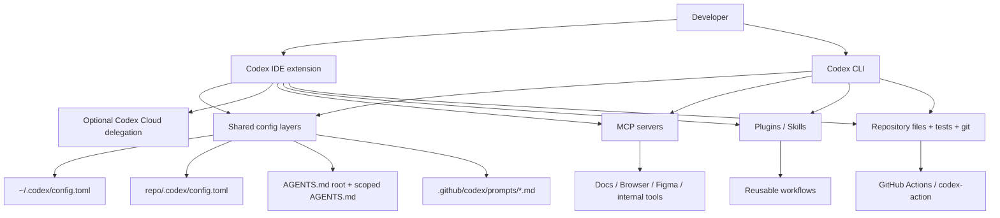

# Thiết lập workspace mới cho dự án phần mềm với Codex CLI và Codex Extension

## Tóm tắt điều hành

Nếu mục tiêu là dựng một workspace mới cho Software Engineering với entity["software","Codex CLI","OpenAI coding agent CLI"] và entity["software","Codex IDE extension","OpenAI coding agent IDE integration"], mẫu thiết lập mạnh nhất hiện nay là **hybrid CLI + IDE**: dùng IDE cho tác vụ tương tác hằng ngày, giữ **user config** ở `~/.codex/config.toml`, giữ **repo config** ở `.codex/config.toml`, đặt **quy tắc dự án** trong `AGENTS.md`, và dùng **`codex exec` + `openai/codex-action`** cho CI/CD. CLI và IDE extension dùng chung các lớp cấu hình; extension hiện hỗ trợ entity["software","Visual Studio Code","source-code editor"], entity["software","Cursor","code editor"], entity["software","Windsurf","code editor"] và JetBrains, nên một layout repo duy nhất có thể phục vụ cả terminal lẫn editor. citeturn39view9turn37view2turn39view4turn36view12

Về model, tài liệu Codex hiện khuyên **ưu tiên `gpt-5.5` khi model này có trong model picker**, nhưng model đó trong Codex hiện **chỉ có khi đăng nhập bằng ChatGPT**, không có với API-key auth; nếu chưa có `gpt-5.5`, hãy dùng `gpt-5.4`, còn `gpt-5.4-mini` phù hợp cho việc nhẹ, tác vụ phụ, hoặc subagent để giảm chi phí. Ở cấp API rộng hơn, `gpt-5.5` có giá cao hơn `gpt-5.4`, vì vậy mặc định cân bằng cho workspace mới thường là `gpt-5.4`, và chỉ nâng lên `gpt-5.5` cho các bài toán khó hoặc nghiên cứu/phân tích sâu. citeturn10view2turn10view4turn10view5turn10view6

Về tiết kiệm token, các đòn bẩy có hiệu quả cao nhất không phải là “mẹo prompt”, mà là **cấu trúc context**: giữ nội dung tĩnh ở đầu prompt để tận dụng prompt caching, đặt quy tắc bền vững vào `AGENTS.md` thay vì lặp lại trong mỗi phiên, tách công việc thành từng thread rõ ràng, dùng Plan mode cho bài toán khó, và chuyển workflow lặp lại thành **skills/plugins/MCP** để Codex chỉ nạp khi cần. Prompt caching trong tài liệu chính thức có thể giảm độ trễ tới 80% và giảm chi phí input tới 90% khi prefix trùng khớp; trong khi đó Fast mode chỉ tăng tốc độ, **không** phải chiến lược tiết kiệm chi phí. citeturn12search0turn39view8turn11view4turn39view7turn39view0

Giả định của báo cáo này là **không có ràng buộc cụ thể** về OS, package manager, hay cloud provider. Vì vậy, mọi ví dụ dưới đây dùng những đường đi mặc định và công cụ mà tài liệu chính thức hoặc repo công khai đang minh họa rõ nhất.

## Các nguồn chính thức nên ghim ngay trong workspace

Các tài liệu chính thức nên được team ghim thẳng vào README nội bộ hoặc wiki dự án là: urlTổng quan Codexturn5view2, urlCodex CLIturn7view12, urlCodex IDE extensionturn7view9, urlAuthenticationturn5view1, urlModels trong Codexturn9view0, urlConfig basicsturn7view0, urlSample configturn7view2, urlAGENTS.md guideturn7view4, urlMCP guideturn7view5, urlPlugins guideturn7view6, urlBest practicesturn7view8, urlNon-interactive modeturn7view14, urlGitHub Action guideturn7view7, urlPrompt caching guideturn12search0, urlCost optimization guideturn12search2, và urlConversation state / compactionturn13search0.  

Điểm nền tảng quan trọng nhất để thống nhất workspace là: user-level config nằm ở `~/.codex/config.toml`, repo-level config nằm ở `.codex/config.toml`, CLI và IDE extension dùng chung các lớp cấu hình này, và precedence đi từ CLI flags → profile → project config → user config → system config → mặc định tích hợp sẵn. Điều này có nghĩa là **repo nên commit `.codex/config.toml` và `AGENTS.md`**, còn **cá nhân** chỉ nên giữ các tùy chọn riêng như model mặc định hoặc notifier ở `~/.codex/config.toml`. citeturn39view9

Về xác thực, tài liệu chính thức chia làm hai nhánh rất rõ: **Sign in with ChatGPT** cho người dùng tương tác và **API key auth** cho workflow lập trình/CI. Khi đăng nhập bằng ChatGPT, usage sẽ đi theo quyền workspace, RBAC, retention/residency của ChatGPT; khi dùng API key, usage đi theo API organization và standard API billing. Tài liệu còn khuyến nghị dùng API key cho workflow programmatic như CI/CD, và bật MFA nếu dùng Codex Cloud. citeturn6view7turn6view8turn6view9

Về extension, tài liệu chính thức xác nhận extension hoạt động với VS Code và các fork như Cursor, Windsurf, đồng thời có bản cho JetBrains IDEs trên macOS, Windows và Linux. Vì extension và CLI cùng chia sẻ config/login layers, một workspace được cấu trúc tốt sẽ không cần “bản cấu hình riêng cho editor” nữa, trừ một vài ngoại lệ môi trường rất cụ thể. citeturn37view2turn37view3turn37view4turn6view8

## Kiến trúc workspace khuyến nghị

Kiến trúc tối ưu cho dự án phần mềm mới là một **repo-governed workspace**: chính repo định nghĩa hành vi mặc định của agent bằng `AGENTS.md`, `.codex/config.toml`, prompt files dưới `.github/codex/prompts/`, và workflow CI dưới `.github/workflows/`; người dùng thì chỉ thêm auth, model mặc định, notifier, hay MCP nội bộ vào `~/.codex/config.toml`. Khi cần mở rộng, thêm **MCP** cho tài liệu/công cụ bên ngoài, và thêm **plugins/skills** cho workflow lặp lại. Trong IDE, có thể offload việc lớn lên Codex Cloud; trong CI, dùng `codex exec` hoặc `openai/codex-action`. citeturn39view9turn39view5turn39view6turn39view7turn36view15turn39view4turn36view12



Một layout repo gọn, dễ scale, và phù hợp cả local lẫn CI thường trông như sau. Mẫu này bám đúng tinh thần cấu hình theo layer, AGENTS theo scope, và prompt-file cho automation/review. citeturn39view9turn39view5turn39view4

```text
repo/
├─ .codex/
│  └─ config.toml
├─ AGENTS.md
├─ src/
│  └─ AGENTS.md              # chỉ khi module này có rule riêng
├─ docs/
│  └─ AGENTS.md              # chỉ khi docs cần workflow riêng
├─ .github/
│  ├─ codex/
│  │  └─ prompts/
│  │     ├─ brainstorm.md
│  │     ├─ planning.md
│  │     └─ developer.md
│  └─ workflows/
│     └─ codex-review.yml
├─ Makefile / justfile / package.json / pyproject.toml
└─ README.md
```

## Bảng so sánh các pattern thiết lập

Bảng dưới đây so sánh năm pattern setup có giá trị thực tế nhất. Tôi dùng **độ liên quan trực tiếp tới Codex** làm tiêu chí chính, rồi mới xét đến **stars/forks** vì urlGitHub Docsturn23search0 có bộ qualifier chuẩn cho stars/forks nhưng không có một “vote metric” phổ quát cho mọi repo. citeturn23search0

| Pattern | Authentication | Token management / cost | Prompt templates | Workspace structure | Extensions / plugins | CI/CD + security | Khi nào nên dùng | Minh chứng |
|---|---|---|---|---|---|---|---|---|
| CLI-local tối giản | ChatGPT sign-in cho dev; API key tùy chọn | `gpt-5.4` làm default cân bằng; `gpt-5.4-mini` cho task nhẹ | Prompt theo khung Goal / Context / Constraints / Done when | `~/.codex/config.toml` + `AGENTS.md` ở repo root | Chưa cần MCP/plugins ngay | Không CI lúc đầu; dùng `codex exec` read-only cho script nhỏ | Solo dev hoặc POC | citeturn39view9turn39view8turn10view4turn10view6turn36view12 |
| IDE-first hybrid | ChatGPT sign-in là thuận tiện nhất; login/cache dùng chung với CLI | Có thể giữ model chung với CLI; cloud delegation cho việc lớn | Plan mode cho việc khó; prompt files cho review/implementation | Repo config + AGENTS + prompt files | IDE extension cho VS Code/Cursor/Windsurf; MCP/plugins mở rộng dần | Human-in-the-loop, review trong editor | Team code hằng ngày trong editor | citeturn37view2turn37view3turn37view4turn6view8turn37view1turn36view15 |
| Team workspace do repo quản trị | ChatGPT workspace cho người; API key riêng cho bot | Giảm lặp bằng `AGENTS.md`, scoped AGENTS, reasoning level phù hợp | Templates commit vào repo để cả team dùng chung | `.codex/config.toml` + root/scoped `AGENTS.md` + `.github/codex/prompts` | MCP cho docs nội bộ; plugins/skills cho workflow chuẩn hóa | Dễ audit vì repo là source of truth | Team muốn nhất quán giữa devs | citeturn39view5turn11view4turn39view8turn39view9turn39view6turn39view7 |
| Skills-first reusable workflows | Tùy auth; dùng tốt cả local lẫn CI | Skills giảm prompt lặp vì chỉ load đầy đủ khi liên quan | `SKILL.md` cho workflow lặp lại; prompt file vẫn giữ cho task cục bộ | Repo/project skills hoặc global skills dir | `openai/skills` hoặc `vercel-labs/skills` / plugins | Có thể commit skills hoặc sync toàn cục | Workflow lặp lại: review, release notes, triage | citeturn34search5turn32search1turn31search0turn39view7 |
| CI/CD review bot | API key auth là khuyến nghị | Prompt-file ổn định + model nhẹ hơn cho review lặp lại; JSON/artifact output | `.github/codex/prompts/review.md` | `.github/workflows/*` + prompt files | `openai/codex-action` | `drop-sudo`, limited triggers, sanitize prompt inputs | PR review tự động, triage, report | citeturn39view4turn37view9turn35search0turn36view12 |

## Top repo GitHub tham khảo

Bảng này là **top 8 repo hữu ích nhất** để học cách cấu trúc workspace quanh Codex. Tôi ưu tiên repo có **độ liên quan trực tiếp với Codex/skills/AGENTS**, sau đó mới nhìn stars. Những repo rất nổi tiếng nhưng không có pattern Codex rõ ràng thì tôi không đưa vào. citeturn23search0

| Repo | Stars | Vì sao nên xem | Relevant files / folders | Setup snippet / pattern đáng lấy | Nguồn |
|---|---:|---|---|---|---|
| urlopenai/codexturn35search4 | ≈76k | Repo tham chiếu quan trọng nhất cho Codex CLI; cho thấy cách repo thật dùng `.codex/skills`, `.devcontainer`, `.github`, `.vscode`, `AGENTS.md`, và monorepo tooling | `.codex/skills`, `.devcontainer`, `.github`, `.vscode`, `AGENTS.md`, `justfile`, `pnpm-workspace.yaml` | `npm install -g @openai/codex` hoặc `brew install --cask codex`; sau đó commit `.codex/config.toml` + `AGENTS.md` theo repo pattern | citeturn25search5turn34search0turn16search0turn23search3 |
| urlopenai/openai-cookbookturn25search4 | ≈72.8k | Không phải runtime repo của Codex, nhưng rất mạnh cho **prompt/example scaffolding** và cách tổ chức example/article/image trong repo lớn | `AGENTS.md`, `examples/`, `articles/`, `images/`, `registry.yaml` | Dùng cấu trúc “examples + docs + shared images” nếu repo của bạn có nhiều demo, notebook, hay tài liệu kỹ thuật | citeturn25search5turn25search4turn21search6 |
| urlvercel-labs/agent-skillsturn32search4 | ≈25.3k | Mẫu tốt nhất cho **skills package**: một skill = `SKILL.md` + `scripts/`; rất hợp để biến workflow lặp thành reusable units | `skills/`, `SKILL.md`, `scripts/`, `.github/workflows`, `AGENTS.md` | `npx skills add vercel-labs/agent-skills`; thích hợp khi bạn muốn skill hóa review/check/deploy | citeturn31search0turn32search4turn31search1 |
| urlopenai/openai-agents-pythonturn25search3 | ≈21.9k | Repo first-party rất giá trị vì có đồng thời `.codex`, `.agents/skills`, `AGENTS.md`, `PLANS.md`, `examples/`, `Makefile`; cho thấy cách repo thật sống chung với agent tooling | `.codex`, `.agents/skills`, `.github`, `.vscode`, `AGENTS.md`, `PLANS.md`, `Makefile`, `examples/` | `uv add openai-agents`; pattern đáng lấy là “repo có plan doc + agent rules + skills + examples” | citeturn25search3turn21search0turn34search4 |
| urlagentsmd/agents.mdturn25search1 | ≈20.3k | Chuẩn mở cho `AGENTS.md`; rất hữu ích để viết file agent instructions có tính portable giữa nhiều công cụ | `AGENTS.md`, site docs, minimal example | Dùng minimal AGENTS với các mục: env tips, testing instructions, PR instructions; tránh file quá dài và mơ hồ | citeturn25search1 |
| urlopenai/skillsturn34search5 | ≈17k | Catalog skills cho Codex; cho thấy cách first-party skill hóa workflow và cài skill curated/experimental | `skills/`, curated/experimental skill folders, README | Dùng `$skill-installer` để cài workflow theo tên hoặc từ GitHub directory URL; phù hợp cho team chuẩn hóa workflow nội bộ | citeturn34search5 |
| urlvercel-labs/skillsturn32search1 | ≈14.6k | CLI skill installer hỗ trợ nhiều agent, trong đó có Codex; rất hay để học cách **project skills vs global skills** và skills lock file | `src/agents.ts`, `skills-lock.json`, `tests/`, `AGENTS.md` | `npx skills add vercel-labs/agent-skills -a codex`; pattern tốt cho lock/sync/update skills | citeturn32search2turn32search1turn31search3 |
| urlopenai/codex-actionturn35search0 | ≈931 | Stars không cao bằng các repo trên nhưng **rất direct** cho CI/CD; minh họa workflow review bot, prompt-file, sandbox và safety strategy | `.github/workflows`, `examples/`, `action.yml`, `docs/` | `uses: openai/codex-action@v1` + `prompt-file` + `safety-strategy: drop-sudo` + `sandbox: workspace-write` | citeturn35search0turn39view4turn37view9 |

Một lưu ý hữu ích cho từ khóa của bạn: **Planning** và **Developer** có đối sánh rất tự nhiên với Plan mode và khung prompt chính thức; **Brainstorm** phù hợp làm prompt-file riêng cho giai đoạn ý tưởng; còn **Antigravity** không xuất hiện như một tính năng first-party trong các tài liệu Codex chính thức tôi rà soát, nhưng lại xuất hiện như một target agent trong hệ sinh thái `vercel-labs/skills`. Điều đó có nghĩa là hãy xem “Antigravity” như một **adjacent ecosystem keyword**, không phải một mode chính thức của Codex. citeturn37view1turn39view8turn32search1turn5view2

## Checklist từng bước để dựng workspace mới

Checklist dưới đây cô đọng các khuyến nghị có độ tin cậy cao nhất từ tài liệu chính thức và repo first-party. citeturn39view9turn5view1turn39view5turn39view6turn39view4turn36view12

- [ ] **Cài Codex CLI** bằng npm hoặc Homebrew, và nếu làm việc trong editor thì cài thêm **Codex IDE extension** từ marketplace tương ứng. citeturn35search4turn37view2
- [ ] **Chọn auth path**: dùng **ChatGPT sign-in** cho developer tương tác; dùng **API key** cho workflow script/CI/CD. citeturn6view7turn6view8
- [ ] **Tạo `~/.codex/config.toml`** để chứa tùy chọn user-level như model mặc định, approval policy, notifier, hoặc MCP nội bộ. citeturn39view9turn39view2turn39view3
- [ ] **Commit `.codex/config.toml` vào repo** để team có cùng sandbox/approval/model policy ở mức dự án. citeturn39view9
- [ ] **Thêm `AGENTS.md` ở repo root**, và chỉ thêm `src/AGENTS.md`, `docs/AGENTS.md`… khi module đó thật sự cần rule riêng. citeturn39view5turn11view4
- [ ] **Thêm prompt files** như `brainstorm.md`, `planning.md`, `developer.md` dưới `.github/codex/prompts/` để tái sử dụng trong CLI/CI. citeturn39view8turn39view4
- [ ] **Chỉ bật MCP/plugins/skills khi có nhu cầu rõ**; tránh nạp quá nhiều tool mặc định ngay từ đầu. citeturn39view6turn39view7
- [ ] **Thiết lập CI review bot** bằng `openai/codex-action`, giới hạn trigger, dùng `drop-sudo`, và giữ prompt theo file thay vì inline dài dòng. citeturn39view4turn37view9
- [ ] **Chuẩn hóa vòng lặp review**: kế hoạch trước với `/plan`, review diff bằng `/review`, rồi mới hợp nhất vào PR. citeturn37view1turn39view1
- [ ] **Mặc định model**: `gpt-5.4` cho workspace mới; nâng lên `gpt-5.5` khi tài khoản có rollout và bài toán đủ khó; hạ xuống `gpt-5.4-mini` cho subagent/task nhẹ. citeturn10view2turn10view4turn10view6

Sơ đồ timeline khuyến nghị cho quá trình setup ban đầu như sau. citeturn39view9turn39view5turn39view4turn36view12

```mermaid
flowchart LR
    A[Khởi tạo repo] --> B[Cài CLI và/hoặc IDE extension]
    B --> C[Chọn auth: ChatGPT hoặc API key]
    C --> D[Tạo ~/.codex/config.toml]
    D --> E[Commit repo/.codex/config.toml]
    E --> F[Viết AGENTS.md root]
    F --> G[Thêm prompt files: brainstorm / planning / developer]
    G --> H[Bật skills / MCP nếu cần]
    H --> I[Thêm codex-action vào CI]
    I --> J[Chạy /plan -> implement -> /review]
```



Mẫu lệnh cài đặt và khởi động đầu tiên có thể giữ ngắn như sau. Cài CLI là bước chính thức và trực tiếp nhất; extension là tùy chọn bổ sung cho editor. citeturn35search4turn37view2

```bash
# Cài CLI
npm install -g @openai/codex
# hoặc
brew install --cask codex

# Bắt đầu phiên đầu tiên
codex
```

Mẫu cấu hình dưới đây chỉ dùng các điểm bám chính thức có độ chắc cao: user config / repo config, approval policy, Fast mode tùy chọn, và MCP server table. Nếu team bạn cần thêm khóa nâng cao, hãy mở rộng từ config reference chính thức. citeturn39view9turn39view2turn39view3turn39view0

```toml
# ~/.codex/config.toml
model = "gpt-5.4"
approval_policy = "on-request"

# Bật khi bạn thật sự muốn ưu tiên tốc độ hơn credits
# service_tier = "fast"
# [features]
# fast_mode = true

[mcp_servers.docs]
command = "docs-server"
required = false
```

```toml
# repo/.codex/config.toml
approval_policy = "on-request"
# Nếu repo này rất an toàn và cần thao tác chỉnh sửa thường xuyên,
# team có thể cân nhắc nới policy sau khi đã thử ở mức mặc định.
```

`AGENTS.md` tốt nhất nên đóng vai trò **README cho agent**, không phải policy dump. Tài liệu chính thức gợi ý nó nên nói rõ repo layout, build/test/lint commands, conventions, constraints, và định nghĩa “done”. citeturn11view4turn11view5

```md
# AGENTS.md

## Mục tiêu repo
Dự án này là dịch vụ backend + frontend cho sản phẩm X.

## Repo layout
- `apps/web`: giao diện chính
- `apps/api`: API
- `packages/shared`: code dùng chung

## Lệnh chuẩn
- Cài dependencies: `pnpm install`
- Chạy dev: `pnpm dev`
- Lint: `pnpm lint`
- Test: `pnpm test`

## Conventions
- Ưu tiên diff nhỏ, không refactor lan rộng nếu không cần.
- Khi đổi hành vi, phải cập nhật test liên quan.
- Không thêm dependency mới nếu có thể tránh.

## Done when
- Test pass
- Lint pass
- Thay đổi có mô tả ngắn gọn trong PR
```

Ba prompt templates dưới đây là cách tôi khuyến nghị ánh xạ trực tiếp các keyword **Brainstorm**, **Planning**, và **Developer** vào workspace mới. Chúng bám rất sát khung prompt chính thức Goal / Context / Constraints / Done when, và tránh biến AGENTS thành nơi chứa mọi thứ. citeturn39view8turn37view1

```md
# .github/codex/prompts/brainstorm.md
Goal: đề xuất 3-5 hướng tiếp cận cho vấn đề này.
Context: mô tả bài toán, file liên quan, ràng buộc hệ thống.
Constraints: ưu tiên phương án ít rủi ro, ít lock-in, dễ rollout.
Done when: có bảng trade-off, khuyến nghị cuối, và các câu hỏi còn mở.
```

```md
# .github/codex/prompts/planning.md
Goal: lập kế hoạch triển khai trước khi sửa code.
Context: nêu các file/folder, test, docs, hoặc lỗi liên quan.
Constraints: không viết code ngay; chỉ phân tích, chia bước, chỉ ra rủi ro.
Done when: có plan theo từng bước, file dự kiến sửa, và chiến lược test/review.
```

```md
# .github/codex/prompts/developer.md
Goal: triển khai thay đổi nhỏ nhất để đạt yêu cầu.
Context: chỉ rõ file liên quan và lỗi hoặc feature cần sửa.
Constraints: giữ diff nhỏ, không đụng phần ngoài phạm vi, cập nhật test nếu cần.
Done when: code pass test/lint và có tóm tắt thay đổi theo file.
```

Đối với CI/CD, mẫu workflow tối thiểu đáng dùng là review bot theo prompt-file. Đây là pattern first-party rõ nhất hiện nay cho automation. citeturn39view4turn37view9turn35search0

```yaml
name: codex-review
on:
  pull_request:
    types: [opened, synchronize]

jobs:
  codex:
    runs-on: ubuntu-latest
    permissions:
      contents: read
      pull-requests: write
    steps:
      - uses: actions/checkout@v5
      - name: Run Codex
        id: run_codex
        uses: openai/codex-action@v1
        with:
          openai-api-key: ${{ secrets.OPENAI_API_KEY }}
          prompt-file: .github/codex/prompts/developer.md
          output-file: codex-output.md
          safety-strategy: drop-sudo
          sandbox: workspace-write
```

## Best practices để tiết kiệm token và tăng năng suất developer

Điểm tiết kiệm token quan trọng nhất là **đừng nhồi mọi thứ vào prompt mỗi lần**. Tài liệu prompt caching nói rất rõ rằng cache hit chỉ xảy ra với **exact prefix matches**, nên tất cả phần tĩnh — system/developer instructions, schema, ví dụ, tool definitions — nên nằm ở đầu; phần biến thiên nên để cuối. Với prompt đủ dài, caching có thể giảm độ trễ tới 80% và chi phí input tới 90%; nếu dùng API trực tiếp, có thể thêm `prompt_cache_key` để tăng tỉ lệ cache hit. citeturn12search0

Vì vậy, trong workspace Codex, chiến lược token-saving tốt nhất là: **đưa quy tắc lâu dài vào `AGENTS.md`**, **đưa workflow lặp vào skills/plugins**, và **đưa prompt tình huống vào prompt-file ổn định**. Cách này vừa làm prefix ổn định hơn, vừa tránh việc developer lặp lại cùng một đoạn hướng dẫn dài trong mọi phiên. Tài liệu plugins xác nhận plugins có thể bundle skills, apps và MCP servers; còn best practices nhấn mạnh `AGENTS.md` là nơi tốt nhất để mã hóa cách team muốn Codex làm việc trong repo. citeturn39view7turn11view4

Cũng không nên giữ một thread “ôm cả dự án” quá lâu. Best practices chính thức khuyên giữ **một thread cho một đơn vị công việc coherent**, dùng `/fork` khi luồng công việc thật sự rẽ nhánh, dùng `/compact` khi hội thoại dài, và dùng subagents cho các việc bounded như thăm dò, test, hoặc triage. Ở cấp API, guide về conversation state còn cung cấp `/responses/compact` để co ngữ cảnh cho workflow dài. citeturn11view5turn11view9turn13search0turn13search2

Về cost/model strategy, công thức thực dụng cho software teams hiện giờ là: **`gpt-5.4` làm model mặc định**, **`gpt-5.5` cho các bài toán coding/research/tool-use phức tạp**, và **`gpt-5.4-mini` cho triage, rewrite nhỏ, hoặc subagents**. Nếu bạn bật Fast mode thì sẽ có thêm tốc độ nhưng tiêu tốn credits cao hơn; tài liệu chính thức nêu rõ Fast mode cho `gpt-5.5` và `gpt-5.4` tăng tốc 1.5x nhưng tiêu thụ credits theo hệ số cao hơn, nên đây là lựa chọn productivity chứ không phải cost-saving. citeturn10view2turn10view4turn10view6turn39view0

Về workflow cho developer, prompt nên luôn có bốn thành phần: **Goal, Context, Constraints, Done when**. Với task khó, hãy bắt đầu bằng Plan mode rồi mới cho phép agent sửa code. Với local work, `/review` là một pattern rất tốt để chạy code review trên diff hoặc commit trước khi mở PR. Với automation, `codex exec --json` và `--output-schema` giúp biến output thành machine-readable, dễ ghép vào pipeline hơn. citeturn39view8turn37view1turn39view1turn36view12

Cuối cùng, về security, mặc định an toàn nên là **approval policy bảo thủ**, sandbox tối thiểu cần thiết, và trigger CI giới hạn. Với CI, first-party docs khuyên giữ `safety-strategy: drop-sudo`, giới hạn ai được phép kích hoạt workflow, và sanitize prompt inputs lấy từ PR body, issue body, commit messages để giảm prompt injection risk. citeturn39view2turn36view12turn37view9

## Câu hỏi mở và giới hạn

Có ba giới hạn cần nói rõ. Thứ nhất, **“Antigravity” không xuất hiện như một mode hoặc surface first-party trong các tài liệu Codex chính thức được rà soát ở đây**; từ khóa này hiện hợp lý hơn nếu bạn dùng nó như nhãn/prompt/target trong một hệ sinh thái skills đa-agent, thay vì xem nó là tính năng chính thức của Codex. citeturn32search1turn5view2turn6view1

Thứ hai, **GitHub không có một metric “vote” chuẩn, phổ quát cho repository search**; vì vậy phần “top 8 repos” của báo cáo dùng **stars**, **forks**, và **độ liên quan trực tiếp tới Codex workspace setup** làm proxy để xếp hạng. citeturn23search0

Thứ ba, **stars và một số chi tiết repo là ảnh chụp theo thời điểm crawl**, nên các con số sẽ trôi theo thời gian. Những gì ít biến động hơn — cấu trúc workspace, pattern AGENTS/skills/MCP, auth split cho người dùng vs CI, và khuyến nghị model/sandbox — mới là phần nên coi như “thiết kế bền” cho workspace của bạn. citeturn25search5turn25search3turn34search5turn35search0turn39view9