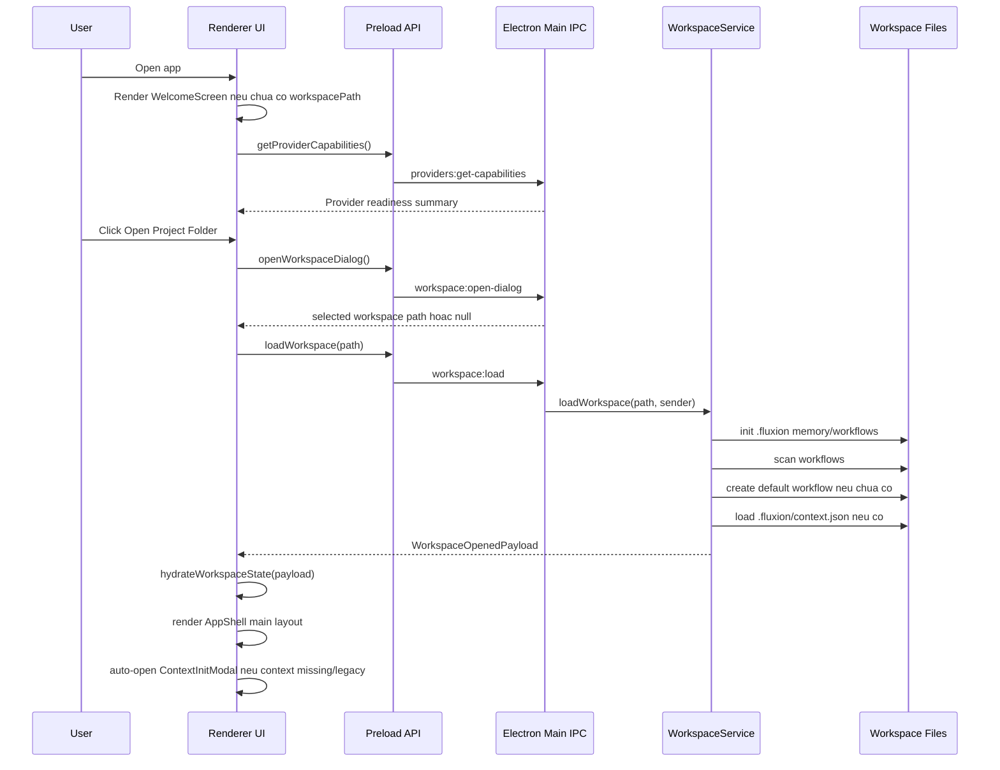

# Bao Cao Luong Open Workspace Den Man Hinh Chinh

Ngay tao: 2026-05-07

Pham vi: tai lieu nay mo ta luong tu luc app Fluxion khoi dong, user mo mot workspace, he thong load workspace, den khi man hinh chinh duoc hien thi. Tai lieu chua di vao thiet ke, cau hinh, thuc thi, hay output cua cac node trong workflow.

## 1. Muc Tieu

Tai lieu nay dung de review UX/UI va system flow hien tai, dong thoi lam input cho Claude Sonnet 4.6 Adaptive phan bien.

No can tra loi cac cau hoi:

- User thay gi khi mo app?
- User lam gi de mo workspace?
- He thong lam gi o main process va renderer process?
- Nhung output nao duoc tao ra tren disk, trong memory store, va tren UI?
- Format/structure cua cac output la gi?
- Vi sao moi output can ton tai?

## 2. Tom Tat Luong



## 3. Source Map

| Layer | File | Vai tro |
| --- | --- | --- |
| Electron bootstrap | `src/main/index.ts` | Tao `BrowserWindow`, load renderer URL/file, register IPC handlers. |
| IPC handlers | `src/main/ipc/workflow.handlers.ts` | Xu ly open dialog, load workspace, read/save workflow, read/save context. |
| Workspace service | `src/main/services/workspace.service.ts` | Khoi tao workspace, scan/load workflows, load context, start watcher. |
| Memory service | `src/main/services/memory-manager.ts` | Khoi tao thu muc memory va doc global context khi runtime can. |
| Preload bridge | `src/preload/index.ts` | Expose `window.api` cho renderer. |
| App root | `src/renderer/src/App.tsx` | Gan IPC listeners, autosave hook, render `AppShell`. |
| Shell layout | `src/renderer/src/components/layout/AppShell.tsx` | Chon WelcomeScreen hay main app layout, dieu khien ContextInit modal. |
| Welcome UI | `src/renderer/src/components/layout/WelcomeScreen.tsx` | Man hinh dau tien khi chua mo workspace. |
| Session helpers | `src/renderer/src/lib/workflow-session.ts` | Goi IPC load workspace, hydrate store, fetch provider capability. |
| State store | `src/renderer/src/stores/workflow.store.ts` | Luu workspace path, workflow metadata, context state, UI flags. |
| Main UI | `src/renderer/src/components/layout/Sidebar.tsx`, `Topbar.tsx`, `FlowCanvas.tsx` | Man hinh chinh sau khi workspace loaded. |
| Context setup | `src/renderer/src/components/layout/ContextInitModal.tsx` | Khoi tao/review/save project context neu thieu hoac legacy. |

## 4. Phase 0 - App Bootstrap

### User Action

User mo Fluxion app.

### UX/UI

Ban dau Electron window duoc tao voi kich thuoc mac dinh `900 x 670`, chua hien ngay lap tuc. Window chi hien khi event `ready-to-show` duoc kich hoat.

Trong development, renderer duoc load tu Vite dev server. Trong production, renderer duoc load tu file HTML build san.

### System Action

Main process:

1. Goi `app.whenReady()`.
2. Set app user model id bang `electronApp.setAppUserModelId('com.electron')`.
3. Gan shortcut/dev behavior bang `optimizer.watchWindowShortcuts`.
4. Register IPC handlers qua `registerWorkflowHandlers()`.
5. Tao `BrowserWindow`.
6. Load renderer.

Renderer process:

1. `App.tsx` mount React app.
2. `useIpcListeners()` bind cac listener IPC global.
3. `useWorkflowPersistence()` bat autosave khi co workspace va workflow dirty.
4. `AppShell` doc `workspacePath` tu Zustand store.

### Output

| Output | Format/Structure | Ly do ton tai |
| --- | --- | --- |
| Electron window | Native BrowserWindow | Container chinh cua UI. |
| IPC handlers | Runtime registrations | Cho renderer goi main process an toan qua preload bridge. |
| Initial renderer state | Zustand store defaults | App can biet chua co workspace de render WelcomeScreen. |

## 5. Phase 1 - Welcome Screen Khi Chua Co Workspace

### Dieu kien hien thi

`AppShell` render `WelcomeScreen` khi `workspacePath === null`.

### UX/UI

Welcome screen la man hinh full viewport, tap trung vao mot luong hanh dong duy nhat: mo project folder.

Thanh phan UI chinh:

| UI Element | Mo ta | Ly do |
| --- | --- | --- |
| Logo/glyph Fluxion | Icon workflow va ten app | Xac nhan user dang o dung app/trang thai start. |
| Mo ta ngan | "Run Codex agents across your codebase as a workflow." | Dinh vi san pham nhung khong dua vao node details. |
| 3-step onboarding | `Open your codebase`, `Define Codex agents`, `Run and review outputs` | Giai thich duong di tong quat. Tai lieu nay chi phan tich buoc dau. |
| CTA `Open Project Folder` | Nut chinh co icon folder | Hanh dong duy nhat de vao workspace. |
| Global Settings button | Nut icon o goc tren phai | Cho phep user cau hinh provider/API truoc khi mo workspace. |
| Codex readiness chip/card | Hien trang thai Codex CLI/provider | Can canh bao som neu moi truong chua san sang. |

### User Action

User co the:

1. Click `Open Project Folder`.
2. Click Global Settings.
3. Refresh provider readiness neu co warning.

### System Action

Welcome screen goi:

```ts
fetchProviderCapabilities()
```

Neu user click `Open Project Folder`:

```ts
openWorkspaceFromDialog()
```

Ham nay goi preload API:

```ts
window.api.openWorkspaceDialog()
```

### Output

| Output | Format/Structure | Ly do |
| --- | --- | --- |
| Provider capability state | `ProviderCapabilitiesMap` trong `workflow.store` | De UI biet Codex CLI/model/provider co san sang hay khong. |
| Readiness badge/card | Derived UI state | Giam truong hop user mo workspace xong moi phat hien provider blocked. |
| Selected path hoac `null` | String absolute path | Input cho phase load workspace. |

## 6. Phase 2 - Open Workspace Dialog

### User Action

User click `Open Project Folder`, chon mot folder trong native OS dialog.

### UX/UI

Dialog la native folder picker cua Electron/OS. Trong main handler:

```ts
dialog.showOpenDialog({
  title: 'Open Workspace',
  buttonLabel: 'Open Workspace',
  defaultPath: app.getPath('documents'),
  properties: ['openDirectory', 'createDirectory'],
})
```

### System Action

IPC flow:

| Step | Channel/API | Actor |
| --- | --- | --- |
| Renderer -> Preload | `window.api.openWorkspaceDialog()` | Renderer |
| Preload -> Main | `workspace:open-dialog` | Electron IPC |
| Main -> OS | `dialog.showOpenDialog()` | Electron main |
| Main -> Renderer | selected path hoac `null` | IPC response |

Neu user cancel, flow dung lai va van o WelcomeScreen.

### Output

| Output | Format/Structure | Ly do |
| --- | --- | --- |
| `selectedPath` | Absolute folder path string | La root workspace ma toan bo Fluxion se doc/ghi vao. |
| `null` | Null | Phan biet cancel voi error. UI khong can hien loi khi user cancel. |

## 7. Phase 3 - Load Workspace Trong Main Process

### Entry Point

Renderer goi:

```ts
loadWorkspaceFromPath(selectedPath)
```

Ham nay goi:

```ts
window.api.loadWorkspace(workspacePath)
```

IPC main nhan channel:

```ts
workspace:load
```

Va chuyen sang:

```ts
workspaceService.loadWorkspace(workspacePath, event.sender)
```

### System Action Chi Tiet

`WorkspaceService.loadWorkspace` lam cac viec sau:

1. Resolve absolute workspace path.
2. Khoi tao memory workspace:

```ts
memoryManager.initWorkspace(resolvedWorkspacePath)
```

3. Scan workflow files:

```ts
scanWorkflows(resolvedWorkspacePath)
```

4. Neu chua co workflow nao:
   - Tao default workflow.
   - Ghi file vao `.fluxion/workflows/{slug}.fluxion.json`.
   - Mark `isNewWorkspace = true`.

5. Neu da co workflow:
   - Uu tien workflow dang active neu van ton tai.
   - Neu khong, chon workflow moi update gan nhat.

6. Start file watcher cho workspace.
7. Load project context:

```ts
getContext(resolvedWorkspacePath)
```

8. Tra ve `WorkspaceOpenedPayload`.

### Disk Read/Write

| Path | Read/Write | Khi nao | Ly do |
| --- | --- | --- | --- |
| `.fluxion/workflows/` | Read/Create | Moi lan load workspace | Noi luu workflow documents. |
| `.fluxion/workflows/*.fluxion.json` | Read/Write | Load existing hoac tao default | Persist workflow document cua workspace. |
| `.fluxion/workflow.json` | Read | Neu legacy ton tai | Backward compatibility voi format cu. |
| `.fluxion/context.json` | Read | Moi lan load workspace | Lay project context state hien tai. |
| `.fluxion/memory/` | Create | Khi init workspace | Thu muc memory/runtime context. |

### Output: WorkspaceOpenedPayload

Payload tra ve renderer co dang:

```ts
interface WorkspaceOpenedPayload {
  workspacePath: string;
  workflow: Workflow;
  activeWorkflowFilePath: string;
  activeWorkflowId: string;
  workflows: WorkflowMetadata[];
  isNewWorkspace: boolean;
  contextStatus: 'missing' | 'incomplete' | 'ready' | 'legacy';
  contextSummary?: ProjectContextDraft | null;
  legacyWorkflowDetected: boolean;
}
```

### Ly Do Tung Field

| Field | Ly do |
| --- | --- |
| `workspacePath` | Renderer can root path de hien thi, save, reload, va gui lai cho IPC sau nay. |
| `workflow` | Tai lieu workflow active de hydrate canvas/main screen. |
| `activeWorkflowFilePath` | Save dung file hien tai, khong ghi nham workflow khac. |
| `activeWorkflowId` | Dinh danh workflow active cho UI/session logic. |
| `workflows` | Sidebar can danh sach workflow archive. |
| `isNewWorkspace` | UI co the biet workspace moi de onboarding/context setup. |
| `contextStatus` | AppShell quyet dinh co auto-open ContextInitModal hay khong. |
| `contextSummary` | ContextInitModal va runtime summary can ban context hien co. |
| `legacyWorkflowDetected` | UI can canh bao/chuyen doi workflow format cu. |

## 8. Phase 4 - Hydrate Renderer State

### System Action

Renderer helper:

```ts
hydrateWorkspaceState(payload)
```

Thuc hien:

1. `useWorkflowStore.getState().hydrateWorkspace(payload)`
2. `setContextState(payload.contextStatus, payload.contextSummary ?? null)`
3. Reset execution state ve idle.
4. Fetch provider capabilities:

```ts
fetchProviderCapabilities()
```

### Store Output

`workflow.store` duoc hydrate voi cac nhom state:

| State Group | Vi du field | Ly do |
| --- | --- | --- |
| Workspace identity | `workspacePath` | Xac dinh app da vao main screen. |
| Workflow identity | `workflowId`, `workflowName`, `activeWorkflowFilePath` | Dung cho topbar/sidebar/save state. |
| Workflow document state | `nodes`, `edges`, `executionMode` | Render main canvas. Tai lieu nay khong di vao node details. |
| Save state | `isDirty`, `isSaving`, `lastSavedAt`, `saveError` | Topbar hien save status va autosave logic. |
| Workflow list | `workflows`, `legacyWorkflowDetected` | Sidebar hien workflow archive. |
| Context state | `contextStatus`, `contextSummary`, `isContextSetupOpen` | Dieu khien ContextInit UX. |
| Provider state | `providerCapabilities`, `isProviderCapabilitiesLoading` | Readiness badge va runtime checks. |

### Output

| Output | Format/Structure | Ly do |
| --- | --- | --- |
| Hydrated Zustand state | In-memory store | Renderer can render main screen ma khong doc disk truc tiep. |
| Reset execution state | In-memory execution store | Dam bao workspace moi khong ke thua status/log cua session cu. |
| Provider capability refresh | IPC result -> store | Main screen can hien provider readiness chinh xac. |

## 9. Phase 5 - AppShell Chuyen Sang Main Screen

### Dieu Kien

Sau hydrate, `workspacePath` khac `null`, nen `AppShell` khong render `WelcomeScreen` nua.

### UX/UI Man Hinh Chinh

Main screen co layout:

```text
+---------------------------------------------------------------+
| Sidebar | Topbar                                              |
|         |-----------------------------------------------------|
|         | Main work area                                      |
|         | - FlowCanvas                                        |
|         | - PropertiesPanel                                   |
|         | - TerminalViewer neu duoc mo                        |
+---------------------------------------------------------------+
```

### Sidebar

Sidebar hien:

| UI | Format | Ly do |
| --- | --- | --- |
| Library header | Glyph + label | Dinh vi day la workflow archive cua workspace. |
| Workflow list | `WorkflowMetadata[]` | Cho user thay cac workflow da co trong workspace. |
| Active indicator | Highlight + left accent | Biet workflow nao dang active. |
| Create workflow action | Icon plus | Cho phep tao workflow moi trong workspace. |
| Collapse action | Icon chevron | Tang dien tich lam viec. |

### Topbar

Topbar hien:

| UI | Input source | Ly do |
| --- | --- | --- |
| Workspace/project name | `workspacePath` basename | User biet dang lam trong workspace nao. |
| Workflow name | `workflowName` | Dinh danh document active. |
| Save status chip | `isDirty`, `isSaving`, `saveError` | Cho biet local workflow da duoc persist chua. |
| Context status chip | `contextStatus` | Cho biet Fluxion context missing/incomplete/ready/legacy. |
| Provider readiness | `providerCapabilities` | Canh bao neu Codex/provider chua san sang. |
| Open workspace action | Folder icon/menu | Doi workspace. |
| Save/reload actions | Store + IPC | Lam viec voi file workflow active. |
| Settings/theme | User preferences | Dieu chinh global behavior. |

### Main Work Area

Trong pham vi tai lieu nay, main work area chi duoc mo ta o muc shell:

| UI | Mo ta | Ly do |
| --- | --- | --- |
| FlowCanvas | Vung lam viec chinh cua workflow | Day la surface trung tam sau khi workspace loaded. |
| Empty state | Hien khi workflow document chua co noi dung lam viec | Huong user den buoc tiep theo ma khong can doc docs. |
| PropertiesPanel | Panel cau hinh ben phai khi co selection phu hop | Giu main canvas va configuration tach nhau. |
| TerminalViewer | An mac dinh, chi hien khi user mo output/runtime view | Khong chiem dien tich neu chua co runtime activity. |

## 10. Phase 6 - ContextInit Modal Neu Context Missing/Legacy

### Dieu Kien Auto Open

`AppShell` co effect:

```ts
if (contextStatus === 'missing' || contextStatus === 'legacy') {
  setContextSetupOpen(true);
}
```

Neu context la `incomplete`, modal khong auto-open, nhung topbar van co context status de user mo lai.

### UX/UI

ContextInitModal la overlay tren main screen, co 3 vung:

| Vung | Noi dung | Ly do |
| --- | --- | --- |
| Left stepper | Detect Workspace, Stable Rules, Project Brief, Agent Focus, Review & Save | Chia context init thanh cac buoc nho, de user review duoc. |
| Center form | Input/edit context theo step | Cho user sua output deterministic scan truoc khi save. |
| Right preview | Readable Brief, `global-context.md`, `context.json` | Cho user thay chinh xac Fluxion se ghi/dua vao runtime. |

### System Action Khi Modal Mount

Modal goi song song:

```ts
window.api.scanWorkspaceContext(workspacePath)
window.api.getContext(workspacePath)
```

Sau do merge:

```ts
mergeScanIntoDraft(workspacePath, scanResult, existingContext, initialStatus)
```

### Output Tu Context Scan

`ContextScanResult` co dang:

```ts
interface ContextScanResult {
  workspaceType: 'blank' | 'existing' | 'existing_with_instructions';
  projectName: string;
  detectedFields: Partial<ProjectContextDraft>;
  sourceEvidence: ContextSourceEvidence[];
  unresolvedFields: ProjectContextField[];
  scannedFiles: string[];
  discoveredPaths: string[];
}
```

### Ly Do Cac Output Context

| Output | Format/Structure | Ly do |
| --- | --- | --- |
| `workspaceType` | Enum | Chon UX blank kickoff hay existing repo review. |
| `projectName` | Workspace folder name | Nhan dien workspace on dinh, tranh bi lech do manifest parent/artifact. |
| `detectedFields` | Partial draft | Nap san stack, commands, paths, risks de user khong phai nhap tay. |
| `sourceEvidence` | Evidence array co `field`, `sourcePath`, `confidence`, `detectorId`, `id` | Agent/user co the trace tai sao context duoc suy ra. |
| `unresolvedFields` | Field list | Noi cho UI biet phan nao con thieu. |
| `scannedFiles` | Relative paths | Minh bach ve pham vi scan. |
| `discoveredPaths` | Relative paths | Goi y cac path quan trong cho user. |

### Save Context Output

Khi user save draft/final/skip, renderer goi:

```ts
window.api.saveProjectContext(workspacePath, draft, mode)
```

Main ghi:

| File | Format | Ly do |
| --- | --- | --- |
| `.fluxion/context.json` | Structured JSON `ProjectContextDraft` | Canonical workspace context cho Fluxion. |
| `.fluxion/memory/global-context.md` | Markdown co frontmatter | Ban compact de agent runtime doc nhanh. |

`WorkspaceContextSavedPayload` tra ve:

```ts
interface WorkspaceContextSavedPayload {
  contextStatus: WorkspaceContextStatus;
  context: ProjectContextDraft;
}
```

Renderer cap nhat store va dong modal:

```ts
setContextState(payload.contextStatus, payload.context)
setContextSetupOpen(false)
```

## 11. Format Chinh Cua `.fluxion/context.json`

Context canonical hien tai co cac nhom field:

| Nhom | Field | Ly do |
| --- | --- | --- |
| Metadata | `version`, `lastReviewedAt`, `contextStatus` | Quan ly schema, review, readiness. |
| Workspace identity | `workspaceType`, `projectName`, `workspaceTrust` | Dinh danh workspace va trust posture. |
| Product brief | `projectGoal`, `targetUsers`, `firstMilestone` | Noi cho agent biet muc tieu san pham. |
| Tech signals | `primaryStack`, `languages`, `frameworks`, `packageManagers`, `buildSystems`, `testFrameworks` | Dinh huong cach doc code va chon command. |
| Structure | `importantPaths`, `entrypoints`, `moduleBoundaries`, `components` | Huong agent den dung khu vuc trong repo. |
| Commands | `verificationCommands`, `commandCatalog` | Chuan hoa cach verify. |
| Safety | `generatedOrIgnoredPaths`, `riskFlags`, `securityPolicy` | Giam rui ro doc/ghi nham, command nguy hiem. |
| Workflow guidance | `stableRules`, `focusAreas`, `nonGoals`, `openQuestions`, `recommendedFirstActions` | Dieu huong cong viec sau khi workspace loaded. |
| Agent config | `agentInstructionSources` | Ghi nhan file instruction da ton tai nhu `AGENTS.md`, `CLAUDE.md`, `GEMINI.md`. |
| Traceability | `sourceEvidence` | Cho phep phan bien/cai thien detector dua tren evidence. |
| Gate | `readiness` | Cho UI/runtime biet context da du de dung hay chua. |

## 12. Format Chinh Cua `.fluxion/memory/global-context.md`

Markdown co frontmatter:

```md
---
type: global
version: "2.0"
workspaceType: existing
contextStatus: ready
---
```

Sau frontmatter la cac section ngan:

```md
# Project Brief
# Stable Rules
# Verification
# Technical Signals
# Components
# Command Catalog
# Agent Instruction Sources
# Current Focus
# Important Paths
# Entrypoints
# Module Boundaries
# Generated or Ignored Paths
# Risk Flags
# Recommended First Actions
# Open Questions
```

Ly do tach Markdown rieng:

- Agent runtime can prompt/context ngan, de doc hon JSON.
- User co the inspect bang editor binh thuong.
- Memory manager co the compile vao runtime context ma khong can UI.

## 13. Output List Tong Hop

### Output Tren Disk

| Output | Created/Read | Format | Ly do |
| --- | --- | --- | --- |
| `.fluxion/` | Create/read | Directory | Root metadata cua Fluxion trong workspace. |
| `.fluxion/workflows/` | Create/read | Directory | Noi luu workflow documents. |
| `.fluxion/workflows/*.fluxion.json` | Create/read/write | JSON | Persist active va archived workflows. |
| `.fluxion/workflow.json` | Read only legacy | JSON | Backward compatibility. |
| `.fluxion/context.json` | Read/write | JSON | Canonical project context. |
| `.fluxion/memory/global-context.md` | Write on context save | Markdown | Compact runtime context. |
| `.fluxion/memory/short-term/` | Init/read later | Directory | Noi luu output runtime ngan han, ngoai pham vi tai lieu nay. |

### Output Trong Renderer Memory

| Output | Store | Ly do |
| --- | --- | --- |
| `workspacePath` | `workflow.store` | Quyet dinh WelcomeScreen hay main screen. |
| `workflowId`, `workflowName`, `activeWorkflowFilePath` | `workflow.store` | Dinh danh workflow document active. |
| `workflows` | `workflow.store` | Render Sidebar. |
| `contextStatus`, `contextSummary` | `workflow.store` | Render context chip va ContextInit modal. |
| `providerCapabilities` | `workflow.store` | Render provider readiness. |
| `recentWorkspaceChanges` | `workflow.store` | Hien external file activity trong topbar/popover. |

### Output Tren UI

| Output | Khi nao | Ly do |
| --- | --- | --- |
| WelcomeScreen | Chua co workspace | Huong user mo project folder. |
| Main shell | Sau khi workspace loaded | Surface lam viec chinh. |
| Sidebar workflow archive | Sau hydrate | Chon/quan ly workflow documents. |
| Topbar status | Sau hydrate | Hien workspace, save, context, provider readiness. |
| ContextInitModal | Context missing/legacy | Bat user tao/review context truoc khi runtime dung. |
| Context preview | Trong ContextInitModal | Minh bach file/context se duoc ghi. |

## 14. Cac Trang Thai Bien/Can Phan Bien

| Scenario | Behavior hien tai | Cau hoi review |
| --- | --- | --- |
| User cancel open dialog | O lai WelcomeScreen | Co can toast "Open cancelled" khong, hay im lang la dung? |
| Workspace rong | Tao default workflow va context missing | Co nen mo ContextInit ngay voi blank kickoff form khong? Hien tai missing se auto-open. |
| Workspace co legacy workflow | Load legacy workflow va flag `legacyWorkflowDetected` | Co can migration prompt rieng khong? |
| Workspace co context incomplete | Main screen hien, modal khong auto-open | Co nen auto-open incomplete neu lan dau load khong? |
| Context missing/legacy | Auto-open ContextInitModal | Co nen cho user skip de vao main screen khong? Hien tai co Skip for now. |
| Provider blocked | Welcome/main readiness warning | Co nen chan open workspace khong? Hien tai khong chan. |
| File watcher bat thay thay doi ngoai | Ghi recent changes | Co nen reload prompt neu active workflow file doi ngoai khong? |

## 15. Diem Can Claude Phan Bien

1. UX hien tai co nen bat buoc ContextInit truoc khi cho vao main screen khong, hay cho vao main screen truoc va hien context banner?
2. `contextStatus === incomplete` co nen auto-open modal khong?
3. Output `.fluxion/context.json` va `.fluxion/memory/global-context.md` da tach dung trach nhiem chua?
4. `WorkspaceOpenedPayload` co dang qua day khong, hay nen tach thanh `WorkspaceSessionPayload` va `ContextPayload`?
5. WelcomeScreen co dang phu thuoc qua nhieu vao Codex readiness khong neu sau nay Fluxion ho tro nhieu agent/provider?
6. Open workspace co nen co preflight trust step truoc khi scan/ghi `.fluxion` khong?
7. UI main screen co can hien ro "workspace context incomplete" bang banner lon hon status chip khong?
8. ContextInit modal co nen la wizard bat buoc hay panel co the mo lai tu topbar?
9. Co nen tao `.fluxion/` ngay khi open workspace, hay chi tao sau khi user confirm trust/context?
10. Co nen tach scan workspace ra sau khi load main screen de tang perceived performance?

## 16. Ket Luan

Luong hien tai co cau truc hop ly cho mot desktop workflow app:

1. App khoi dong vao WelcomeScreen neu chua co workspace.
2. User chon folder qua native dialog.
3. Main process load workspace, init `.fluxion`, scan/load workflows, load context.
4. Renderer hydrate state tu mot payload duy nhat.
5. AppShell render main screen.
6. Neu context missing/legacy, ContextInitModal auto-open de tao canonical context.

Rui ro thiet ke lon nhat hien tai khong nam o code path load workspace, ma nam o UX policy:

- co nen ghi `.fluxion` truoc khi user trust workspace;
- co nen auto-open modal cho incomplete context;
- co nen tach context scan khoi workspace load de load UI nhanh hon;
- co nen thiet ke provider-neutral hon thay vi WelcomeScreen nghieng ve Codex.

