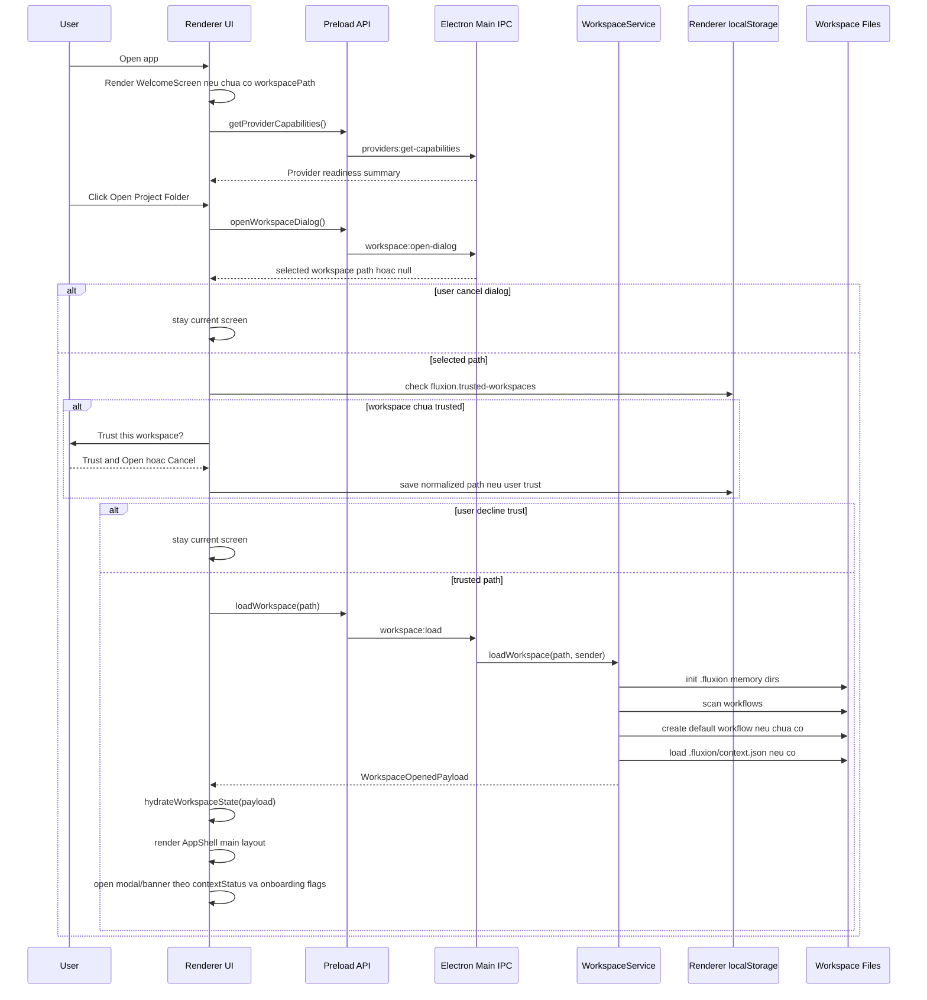

# Bao Cao Luong Open Workspace Den Man Hinh Chinh

Ngay tao: 2026-05-07

Nguon cap nhat: commit `601e52a3b1b6051241ec24c8ab0d76cd69e5839d` tren `origin/main`, ngay 2026-05-07 21:40:17 +0700.

Pham vi: tai lieu nay mo ta luong tu luc app Fluxion khoi dong, user mo mot workspace, he thong load workspace, den khi man hinh chinh duoc hien thi. Tai lieu chua di vao thiet ke, cau hinh, thuc thi, hay output cua cac node trong workflow.

## 1. Muc Tieu

Tai lieu nay dung de review UX/UI va system flow hien tai, dong thoi lam input cho Claude Sonnet 4.6 Adaptive phan bien.

No can tra loi cac cau hoi:

- User thay gi khi mo app?
- User lam gi de mo workspace?
- He thong lam gi o main process va renderer process?
- Nhung output nao duoc tao ra tren disk, trong memory store, va tren UI?
- Format/structure cua cac output la gi?
- Vi sao moi output can ton tai?

## 2. Tom Tat Luong



## 3. Source Map

| Layer | File | Vai tro |
| --- | --- | --- |
| Electron bootstrap | `src/main/index.ts` | Tao `BrowserWindow`, load renderer URL/file, register IPC handlers. |
| IPC handlers | `src/main/ipc/workflow.handlers.ts` | Xu ly open dialog, load workspace, read/save workflow, read/save context. |
| Workspace service | `src/main/services/workspace.service.ts` | Khoi tao workspace, scan/load workflows, load context, start watcher. |
| Memory service | `src/main/services/memory-manager.ts` | Khoi tao thu muc memory va doc global context khi runtime can. |
| Preload bridge | `src/preload/index.ts` | Expose `window.api` cho renderer. |
| App root | `src/renderer/src/App.tsx` | Gan IPC listeners, autosave hook, render `AppShell`. |
| Shell layout | `src/renderer/src/components/layout/AppShell.tsx` | Chon WelcomeScreen hay main app layout, dieu khien ContextInit modal. |
| Welcome UI | `src/renderer/src/components/layout/WelcomeScreen.tsx` | Man hinh dau tien khi chua mo workspace. |
| Workspace trust UI | `src/renderer/src/hooks/useWorkspaceTrustPrompt.tsx` | Confirm truoc khi Fluxion ghi `.fluxion/` vao folder moi. |
| Session helpers | `src/renderer/src/lib/workflow-session.ts` | Chon path, kiem tra trust cache, goi IPC load workspace, hydrate store, fetch provider capability. |
| Provider readiness helpers | `src/renderer/src/lib/provider-capabilities.ts` | Tinh badge/card readiness tu `ProviderCapabilitiesMap`. |
| Context utilities | `src/shared/context.utils.ts` | Normalize context, tinh readiness, skip draft, incomplete banner, render `global-context.md`. |
| State store | `src/renderer/src/stores/workflow.store.ts` | Luu workspace path, workflow metadata, context state, UI flags. |
| Main UI | `src/renderer/src/components/layout/Sidebar.tsx`, `Topbar.tsx`, `FlowCanvas.tsx` | Man hinh chinh sau khi workspace loaded. |
| Context setup | `src/renderer/src/components/layout/ContextInitModal.tsx` | Khoi tao/review/save project context, skip draft, va preview/apply agent config export. |

## 4. Phase 0 - App Bootstrap

### User Action

User mo Fluxion app.

### UX/UI

Ban dau Electron window duoc tao voi kich thuoc mac dinh `900 x 670`, chua hien ngay lap tuc. Window chi hien khi event `ready-to-show` duoc kich hoat.

Trong development, renderer duoc load tu Vite dev server. Trong production, renderer duoc load tu file HTML build san.

### System Action

Main process:

1. Goi `app.whenReady()`.
2. Set app user model id bang `electronApp.setAppUserModelId('com.electron')`.
3. Gan shortcut/dev behavior bang `optimizer.watchWindowShortcuts`.
4. Register IPC handlers qua `registerWorkflowHandlers()`.
5. Tao `BrowserWindow`.
6. Load renderer.

Renderer process:

1. `App.tsx` mount React app.
2. `useIpcListeners()` bind cac listener IPC global.
3. `useWorkflowPersistence()` bat autosave khi co workspace va workflow dirty.
4. `AppShell` doc `workspacePath` tu Zustand store.

### Output

| Output | Format/Structure | Ly do ton tai |
| --- | --- | --- |
| Electron window | Native BrowserWindow | Container chinh cua UI. |
| IPC handlers | Runtime registrations | Cho renderer goi main process an toan qua preload bridge. |
| Initial renderer state | Zustand store defaults | App can biet chua co workspace de render WelcomeScreen. |

## 5. Phase 1 - Welcome Screen Khi Chua Co Workspace

### Dieu kien hien thi

`AppShell` render `WelcomeScreen` khi `workspacePath === null`.

### UX/UI

Welcome screen la man hinh full viewport, tap trung vao mot luong hanh dong duy nhat: mo project folder.

Thanh phan UI chinh:

| UI Element | Mo ta | Ly do |
| --- | --- | --- |
| Logo/glyph Fluxion | Icon workflow va ten app | Xac nhan user dang o dung app/trang thai start. |
| Mo ta ngan | "Run local agents across your codebase as a workflow." | Dinh vi san pham theo local-agent runtime, khong khoa vao OpenAI adapter. |
| 3-step onboarding | `Open your codebase`, `Configure agents`, `Run and review outputs` | Giai thich duong di tong quat. Tai lieu nay chi phan tich buoc dau. |
| CTA `Open Project Folder` | Nut chinh co icon folder | Hanh dong duy nhat de vao workspace. |
| Global Settings button | Nut icon o goc tren phai | Cho phep user cau hinh provider/API truoc khi mo workspace. |
| Provider readiness chip/card | Hien provider summary va Codex readiness khi co warning/blocking | Can canh bao som neu moi truong local agent chua san sang. |
| Trust dialog placeholder | `useWorkspaceTrustPrompt()` render `ConfirmDialog` khi can | Dat trust confirmation ngay trong open-workspace flow. |

### User Action

User co the:

1. Click `Open Project Folder`.
2. Click Global Settings.
3. Refresh provider readiness neu co warning.

### System Action

Welcome screen goi:

```ts
fetchProviderCapabilities()
```

Neu user click `Open Project Folder`:

```ts
openWorkspaceFromDialog(requestWorkspaceTrust)
```

Ham nay goi preload API:

```ts
window.api.openWorkspaceDialog()
```

Sau khi co path, renderer kiem tra trust cache truoc khi goi `loadWorkspace`. Cache duoc luu trong `window.localStorage` voi key:

```ts
fluxion.trusted-workspaces
```

### Output

| Output | Format/Structure | Ly do |
| --- | --- | --- |
| Provider capability state | `ProviderCapabilitiesMap` trong `workflow.store` | De UI biet Codex CLI/model/provider co san sang hay khong. |
| Readiness badge/card | Derived UI state | Giam truong hop user mo workspace xong moi phat hien provider blocked. |
| Selected path hoac `null` | String absolute path | Input cho phase load workspace. |
| Trust decision | Boolean tu `ConfirmDialog` | Chan load workspace neu user chua dong y Fluxion ghi `.fluxion/`. |

## 6. Phase 2 - Open Workspace Dialog Va Trust Gate

### User Action

User click `Open Project Folder`, chon mot folder trong native OS dialog. Neu folder chua co trong trust cache, user phai xac nhan `Trust and Open` truoc khi workspace duoc load.

### UX/UI

Dialog la native folder picker cua Electron/OS. Trong main handler:

```ts
dialog.showOpenDialog({
  title: 'Open Workspace',
  buttonLabel: 'Open Workspace',
  defaultPath: app.getPath('documents'),
  properties: ['openDirectory', 'createDirectory'],
})
```

### System Action

IPC va renderer flow:

| Step | Channel/API | Actor |
| --- | --- | --- |
| Renderer -> Preload | `window.api.openWorkspaceDialog()` | Renderer |
| Preload -> Main | `workspace:open-dialog` | Electron IPC |
| Main -> OS | `dialog.showOpenDialog()` | Electron main |
| Main -> Renderer | selected path hoac `null` | IPC response |
| Renderer | `shouldPromptWorkspaceTrust(selectedPath)` | Kiem tra normalized path trong localStorage. |
| Renderer -> User | `requestWorkspaceTrust(selectedPath)` | Hien `ConfirmDialog` neu path chua trusted. |
| Renderer | `markWorkspaceAsTrusted(selectedPath)` | Luu normalized path neu user confirm. |
| Renderer -> Preload | `window.api.loadWorkspace(selectedPath)` | Chi chay sau trust gate. |

Neu user cancel native dialog hoac decline trust dialog, flow dung lai va van o WelcomeScreen/main screen hien tai. Main process chua nhan `workspace:load`, nen chua tao/ghi `.fluxion/`.

### Output

| Output | Format/Structure | Ly do |
| --- | --- | --- |
| `selectedPath` | Absolute folder path string | La root workspace ma toan bo Fluxion se doc/ghi vao. |
| `null` | Null | Phan biet cancel voi error. UI khong can hien loi khi user cancel. |
| Trusted workspace cache | JSON array string trong `localStorage` | Giam prompt lap lai cho cung mot path trong app data hien tai. |

## 7. Phase 3 - Load Workspace Trong Main Process

### Entry Point

Renderer goi:

```ts
loadWorkspaceFromPath(selectedPath)
```

Entry point nay chi duoc goi sau khi Phase 2 pass trust gate.

Ham nay goi:

```ts
window.api.loadWorkspace(workspacePath)
```

IPC main nhan channel:

```ts
workspace:load
```

Va chuyen sang:

```ts
workspaceService.loadWorkspace(workspacePath, event.sender)
```

### System Action Chi Tiet

`WorkspaceService.loadWorkspace` lam cac viec sau:

1. Resolve absolute workspace path.
2. Khoi tao memory workspace:

```ts
memoryManager.initWorkspace(resolvedWorkspacePath)
```

Buoc nay tao `.fluxion/memory/short-term/`, `.fluxion/memory/long-term/`, va tao placeholder `.fluxion/memory/global-context.md` neu file chua ton tai.

3. Scan workflow files:

```ts
scanWorkflows(resolvedWorkspacePath)
```

4. Neu chua co workflow nao:
   - Tao default workflow.
   - Ghi file vao `.fluxion/workflows/{slug}.fluxion.json`.
   - Mark `isNewWorkspace = true`.

5. Neu da co workflow:
   - Uu tien workflow dang active neu van ton tai.
   - Neu khong, chon workflow moi update gan nhat.

6. Start file watcher cho workspace:
   - Watch toan bo workspace.
   - Bo qua `.git`, `node_modules`, `.fluxion/memory`, `out`, `dist`.
   - Bo qua event vua do Fluxion ghi active workflow trong khoang ngan.
   - Gui `workspace:file-changed` ve renderer, kem `isActiveWorkflow` khi file active workflow doi tren disk.
7. Load project context:

```ts
getContext(resolvedWorkspacePath)
```

8. Tra ve `WorkspaceOpenedPayload`.

### Disk Read/Write

| Path | Read/Write | Khi nao | Ly do |
| --- | --- | --- | --- |
| `.fluxion/workflows/` | Read/Create | Moi lan load workspace | Noi luu workflow documents. |
| `.fluxion/workflows/*.fluxion.json` | Read/Write | Load existing hoac tao default | Persist workflow document cua workspace. |
| `.fluxion/workflow.json` | Read | Neu legacy ton tai | Backward compatibility voi format cu. |
| `.fluxion/context.json` | Read | Moi lan load workspace | Lay project context state hien tai. |
| `.fluxion/memory/` | Create | Khi init workspace | Root memory/runtime context. |
| `.fluxion/memory/global-context.md` | Create neu chua co | Khi init workspace | Placeholder global rules; se duoc ghi lai bang context markdown khi user save context. |
| `.fluxion/memory/short-term/` | Create | Khi init workspace | Noi luu output node theo workflow/run sau nay. |
| `.fluxion/memory/long-term/` | Create | Khi init workspace | Noi luu summarized history sau nay. |

### Output: WorkspaceOpenedPayload

Payload tra ve renderer co dang:

```ts
interface WorkspaceOpenedPayload {
  workspacePath: string;
  workflow: Workflow;
  activeWorkflowFilePath: string;
  activeWorkflowId: string;
  workflows: WorkflowMetadata[];
  isNewWorkspace: boolean;
  contextStatus: 'missing' | 'incomplete' | 'ready' | 'legacy';
  contextSummary?: ProjectContextDraft | null;
  legacyWorkflowDetected: boolean;
}
```

### Ly Do Tung Field

| Field | Ly do |
| --- | --- |
| `workspacePath` | Renderer can root path de hien thi, save, reload, va gui lai cho IPC sau nay. |
| `workflow` | Tai lieu workflow active de hydrate canvas/main screen. |
| `activeWorkflowFilePath` | Save dung file hien tai, khong ghi nham workflow khac. |
| `activeWorkflowId` | Dinh danh workflow active cho UI/session logic. |
| `workflows` | Sidebar can danh sach workflow archive. |
| `isNewWorkspace` | UI co the biet workspace moi de onboarding/context setup. |
| `contextStatus` | AppShell quyet dinh co auto-open ContextInitModal hay khong. |
| `contextSummary` | ContextInitModal va runtime summary can ban context hien co. |
| `legacyWorkflowDetected` | UI can canh bao/chuyen doi workflow format cu. |

## 8. Phase 4 - Hydrate Renderer State

### System Action

Renderer helper:

```ts
hydrateWorkspaceState(payload)
```

Thuc hien:

1. `useWorkflowStore.getState().hydrateWorkspace(payload)`
2. `setContextState(payload.contextStatus, payload.contextSummary ?? null)`
3. Set `isContextSetupOpen` theo policy:
   - `missing` -> auto-open ContextInitModal.
   - `legacy` -> auto-open ContextInitModal.
   - `incomplete` -> chi auto-open neu `payload.isNewWorkspace === true` va `contextOnboarding.initialPromptDismissedAt` chua co.
4. Reset execution state ve idle.
5. Fetch provider capabilities:

```ts
fetchProviderCapabilities()
```

### Store Output

`workflow.store` duoc hydrate voi cac nhom state:

| State Group | Vi du field | Ly do |
| --- | --- | --- |
| Workspace identity | `workspacePath` | Xac dinh app da vao main screen. |
| Workflow identity | `workflowId`, `workflowName`, `activeWorkflowFilePath` | Dung cho topbar/sidebar/save state. |
| Workflow document state | `nodes`, `edges`, `executionMode` | Render main canvas. Tai lieu nay khong di vao node details. |
| Save state | `isDirty`, `isSaving`, `lastSavedAt`, `saveError` | Topbar hien save status va autosave logic. |
| Workflow list | `workflows`, `legacyWorkflowDetected` | Sidebar hien workflow archive. |
| Context state | `contextStatus`, `contextSummary`, `isContextSetupOpen` | Dieu khien ContextInit UX. |
| Context onboarding | `contextSummary.contextOnboarding` | Nho dismiss incomplete banner va keep/migrate legacy decision. |
| Provider state | `providerCapabilities`, `isProviderCapabilitiesLoading` | Readiness badge va runtime checks. |

### Output

| Output | Format/Structure | Ly do |
| --- | --- | --- |
| Hydrated Zustand state | In-memory store | Renderer can render main screen ma khong doc disk truc tiep. |
| Reset execution state | In-memory execution store | Dam bao workspace moi khong ke thua status/log cua session cu. |
| Context setup visibility | `isContextSetupOpen` | Mo modal dung luc, tranh spam modal voi incomplete context da dismiss. |
| Provider capability refresh | IPC result -> store | Main screen can hien provider readiness chinh xac. |

## 9. Phase 5 - AppShell Chuyen Sang Main Screen

### Dieu Kien

Sau hydrate, `workspacePath` khac `null`, nen `AppShell` khong render `WelcomeScreen` nua.

### UX/UI Man Hinh Chinh

Main screen co layout:

```text
+---------------------------------------------------------------+
| Sidebar | Topbar                                              |
|         |-----------------------------------------------------|
|         | Optional context/legacy banner                      |
|         |-----------------------------------------------------|
|         | Main work area                                      |
|         | - FlowCanvas                                        |
|         | - PropertiesPanel                                   |
|         | - TerminalViewer neu duoc mo                        |
+---------------------------------------------------------------+
```

### Sidebar

Sidebar hien:

| UI | Format | Ly do |
| --- | --- | --- |
| Library header | Glyph + label | Dinh vi day la workflow archive cua workspace. |
| Workflow list | `WorkflowMetadata[]` | Cho user thay cac workflow da co trong workspace. |
| Active indicator | Highlight + left accent | Biet workflow nao dang active. |
| Create workflow action | Icon plus | Cho phep tao workflow moi trong workspace. |
| Collapse action | Icon chevron | Tang dien tich lam viec. |

### Topbar

Topbar hien:

| UI | Input source | Ly do |
| --- | --- | --- |
| Workspace/project name | `workspacePath` basename | User biet dang lam trong workspace nao. |
| Workflow name | `workflowName` | Dinh danh document active. |
| Save status chip | `isDirty`, `isSaving`, `saveError` | Cho biet local workflow da duoc persist chua. |
| Context status chip | `contextStatus` | Cho biet Fluxion context missing/incomplete/ready/legacy. |
| Codex readiness chip/popover | `providerCapabilities`, model IDs trong nodes | Canh bao CLI/login/catalog/model warning va huong dan refresh. |
| Activity popover | `recentWorkspaceChanges`, `hasExternalWorkflowChange` | Hien file changes tu watcher, cho open/reveal/copy path, va reload khi active workflow doi tren disk. |
| Open workspace action | Folder icon/menu + trust prompt | Doi workspace nhung van qua trust gate neu path moi chua trusted. |
| Save/reload actions | Store + IPC | Save workflow active hoac reload workspace tu disk. |
| Settings/theme | User preferences | Dieu chinh global behavior. |

### Banner Duoi Topbar

AppShell co the chen banner nam giua Topbar va main work area:

| Banner | Dieu kien | Hanh dong | Ly do |
| --- | --- | --- | --- |
| Context error | Loi khi dismiss/migrate/update onboarding | Hien error text | Khong de action that bai im lang. |
| Project context needs review | `contextStatus === incomplete`, modal dang dong, va dismissal da het han/chua co | `Dismiss`, `Review Context` | Day context gap len ro hon status chip nhung van khong chan main screen. |
| Legacy workflow format detected | `legacyWorkflowDetected` va chua co `contextOnboarding.legacyWorkflowDecision` | `Keep legacy`, `Migrate` | Cho user xu ly `.fluxion/workflow.json` cu ma khong can docs rieng. |

### Main Work Area

Trong pham vi tai lieu nay, main work area chi duoc mo ta o muc shell:

| UI | Mo ta | Ly do |
| --- | --- | --- |
| FlowCanvas | Vung lam viec chinh cua workflow | Day la surface trung tam sau khi workspace loaded. |
| Empty state | Hien khi workflow document chua co noi dung lam viec | Huong user den buoc tiep theo ma khong can doc docs. |
| PropertiesPanel | Panel cau hinh ben phai khi co selection phu hop | Giu main canvas va configuration tach nhau. |
| TerminalViewer | An mac dinh, chi hien khi user mo output/runtime view | Khong chiem dien tich neu chua co runtime activity. |

## 10. Phase 6 - ContextInit Modal Va Context Banners

### Dieu Kien Auto Open

`hydrateWorkspaceState` va `AppShell` cung quyet dinh modal visibility:

```ts
payload.contextStatus === 'missing'
  || payload.contextStatus === 'legacy'
  || shouldShowInitialIncompleteContextPrompt(payload)
```

`AppShell` tiep tuc dam bao `missing` va `legacy` se auto-open neu workspace dang active. `incomplete` khong bi auto-open moi lan; thay vao do main screen hien banner `Project context needs review` neu banner chua duoc dismiss sau lan context save gan nhat.

### UX/UI

ContextInitModal la overlay tren main screen, co 3 vung:

| Vung | Noi dung | Ly do |
| --- | --- | --- |
| Left stepper | Detect Workspace, Stable Rules, Project Brief, Agent Focus, Review & Save | Chia context init thanh cac buoc nho, de user review duoc. |
| Center form | Input/edit context theo step | Cho user sua output deterministic scan truoc khi save. |
| Right preview | Readable Brief, `global-context.md`, `context.json` | Cho user thay chinh xac Fluxion se ghi/dua vao runtime. |
| Agent config export block | Preview/apply exporter nhu `Codex AGENTS.md` sau khi context ready | Dua canonical context sang file instruction cua agent ma khong tron vao `.fluxion/context.json`. |

### System Action Khi Modal Mount

Modal goi song song:

```ts
window.api.scanWorkspaceContext(workspacePath)
window.api.getContext(workspacePath)
```

Sau do merge:

```ts
mergeScanIntoDraft(workspacePath, scanResult, existingContext, initialStatus)
```

### Output Tu Context Scan

`ContextScanResult` co dang:

```ts
interface ContextScanResult {
  workspaceType: 'blank' | 'existing' | 'existing_with_instructions';
  projectName: string;
  detectedFields: Partial<ProjectContextDraft>;
  sourceEvidence: ContextSourceEvidence[];
  unresolvedFields: ProjectContextField[];
  scannedFiles: string[];
  discoveredPaths: string[];
}
```

### Ly Do Cac Output Context

| Output | Format/Structure | Ly do |
| --- | --- | --- |
| `workspaceType` | Enum | Chon UX blank kickoff hay existing repo review. |
| `projectName` | Workspace folder name | Nhan dien workspace on dinh, tranh bi lech do manifest parent/artifact. |
| `detectedFields` | Partial draft | Nap san stack, commands, paths, risks de user khong phai nhap tay. |
| `sourceEvidence` | Evidence array co `field`, `sourcePath`, `confidence`, `detectorId`, `id` | Agent/user co the trace tai sao context duoc suy ra. |
| `unresolvedFields` | Field list | Noi cho UI biet phan nao con thieu. |
| `scannedFiles` | Relative paths | Minh bach ve pham vi scan. |
| `discoveredPaths` | Relative paths | Goi y cac path quan trong cho user. |

### Save Context Output

Khi user save draft/final/skip, renderer goi:

```ts
window.api.saveProjectContext(workspacePath, draft, mode)
```

Main ghi:

| File | Format | Ly do |
| --- | --- | --- |
| `.fluxion/context.json` | Structured JSON `ProjectContextDraft` | Canonical workspace context cho Fluxion. |
| `.fluxion/memory/global-context.md` | Markdown co frontmatter | Ban compact de agent runtime doc nhanh. |

Mode save:

| Mode | Ket qua | Ly do |
| --- | --- | --- |
| `draft` | `contextStatus` thanh `incomplete` | Luu tien do ma chua claim context ready. |
| `skip` | Build skipped draft, `contextStatus` thanh `incomplete`, them `contextOnboarding.initialPromptDismissedAt` | Cho user vao main screen nhung van giu banner nhac review sau. |
| `final` | Validate minimum fields, `ready` neu du dieu kien, neu khong la `incomplete` | Phan biet context da san sang cho runtime voi ban con thieu tin hieu. |

`WorkspaceContextSavedPayload` tra ve:

```ts
interface WorkspaceContextSavedPayload {
  contextStatus: WorkspaceContextStatus;
  context: ProjectContextDraft;
}
```

Renderer cap nhat store va dong modal:

```ts
setContextState(payload.contextStatus, payload.context)
setContextSetupOpen(false)
```

### Agent Config Export Side Flow

Trong review step, modal co the goi cac IPC agent-config:

| Action | IPC/API | Output | Ly do |
| --- | --- | --- | --- |
| List exporters | `window.api.listAgentConfigExporters()` | `AgentConfigExporterSummary[]` | Biet exporter nao kha dung/scaffold. |
| Preview export | `window.api.createAgentConfigPreview(...)` | `AgentConfigExportPreview` gom operations va warnings | Cho user xem file nao se duoc tao/cap nhat truoc khi ghi. |
| Apply export | `window.api.applyAgentConfigPreview(...)` | File operations trong preview | Ghi agent-specific instruction files, vi du `AGENTS.md`, sau khi context da ready. |

## 11. Format Chinh Cua `.fluxion/context.json`

Context canonical hien tai co cac nhom field:

| Nhom | Field | Ly do |
| --- | --- | --- |
| Metadata | `version`, `lastReviewedAt`, `contextStatus` | Quan ly schema, review, readiness. |
| Workspace identity | `workspaceType`, `projectName`, `workspaceTrust` | Dinh danh workspace va trust posture. |
| Product brief | `projectGoal`, `targetUsers`, `firstMilestone` | Noi cho agent biet muc tieu san pham. |
| Tech signals | `primaryStack`, `languages`, `frameworks`, `packageManagers`, `buildSystems`, `testFrameworks` | Dinh huong cach doc code va chon command. |
| Structure | `importantPaths`, `entrypoints`, `moduleBoundaries`, `components` | Huong agent den dung khu vuc trong repo. |
| Commands | `verificationCommands`, `commandCatalog` | Chuan hoa cach verify. |
| Safety | `generatedOrIgnoredPaths`, `riskFlags`, `securityPolicy` | Giam rui ro doc/ghi nham, command nguy hiem. |
| Workflow guidance | `stableRules`, `focusAreas`, `nonGoals`, `openQuestions`, `recommendedFirstActions` | Dieu huong cong viec sau khi workspace loaded. |
| Agent config | `agentInstructionSources` | Ghi nhan file instruction da ton tai nhu `AGENTS.md`, `CLAUDE.md`, `GEMINI.md`. |
| Onboarding UX | `contextOnboarding.initialPromptDismissedAt`, `incompleteBannerDismissedAt`, `legacyWorkflowDecision`, `legacyWorkflowDecisionAt` | Luu cac decision UI ma khong dua vao runtime markdown. |
| Traceability | `sourceEvidence` | Cho phep phan bien/cai thien detector dua tren evidence. |
| Gate | `readiness` | Cho UI/runtime biet context da du de dung hay chua. |

## 12. Format Chinh Cua `.fluxion/memory/global-context.md`

Markdown co frontmatter:

```md
---
type: global
version: "2.0"
workspaceType: existing
contextStatus: ready
---
```

Sau frontmatter la cac section ngan:

```md
# Project Brief
# Stable Rules
# Verification
# Technical Signals
# Components
# Command Catalog
# Agent Instruction Sources
# Current Focus
# Important Paths
# Entrypoints
# Module Boundaries
# Generated or Ignored Paths
# Risk Flags
# Recommended First Actions
# Open Questions
```

Ly do tach Markdown rieng:

- Agent runtime can prompt/context ngan, de doc hon JSON.
- User co the inspect bang editor binh thuong.
- Memory manager co the compile vao runtime context ma khong can UI.

## 13. Output List Tong Hop

### Output Tren Disk

| Output | Created/Read | Format | Ly do |
| --- | --- | --- | --- |
| `.fluxion/` | Create/read | Directory | Root metadata cua Fluxion trong workspace. |
| `.fluxion/workflows/` | Create/read | Directory | Noi luu workflow documents. |
| `.fluxion/workflows/*.fluxion.json` | Create/read/write | JSON | Persist active va archived workflows. |
| `.fluxion/workflow.json` | Read only legacy | JSON | Backward compatibility. |
| `.fluxion/legacy/workflow-*.json` | Write on migrate | JSON backup | Luu ban backup khi user migrate legacy workflow sang thu muc workflows. |
| `.fluxion/context.json` | Read/write | JSON | Canonical project context. |
| `.fluxion/memory/global-context.md` | Create on workspace init, write on context save | Markdown | Compact runtime context; ban dau co placeholder neu chua co context. |
| `.fluxion/memory/short-term/` | Init/read later | Directory | Noi luu output runtime ngan han, ngoai pham vi tai lieu nay. |
| `.fluxion/memory/long-term/` | Init/read later | Directory | Noi luu summarized runtime memory sau nay. |
| Agent instruction files | Optional write via agent config export | Markdown/config | Dua context ready sang tool-specific files nhu `AGENTS.md`. |

### Output Trong Renderer Memory

| Output | Store | Ly do |
| --- | --- | --- |
| `workspacePath` | `workflow.store` | Quyet dinh WelcomeScreen hay main screen. |
| `workflowId`, `workflowName`, `activeWorkflowFilePath` | `workflow.store` | Dinh danh workflow document active. |
| `workflows` | `workflow.store` | Render Sidebar. |
| `contextStatus`, `contextSummary` | `workflow.store` | Render context chip va ContextInit modal. |
| `contextOnboarding` | `contextSummary.contextOnboarding` | Dieu khien incomplete banner va legacy decision. |
| `providerCapabilities` | `workflow.store` | Render provider readiness. |
| `recentWorkspaceChanges` | `workflow.store` | Hien external file activity trong topbar/popover. |
| Trusted workspace paths | `window.localStorage["fluxion.trusted-workspaces"]` | Bo qua trust prompt cho path da duoc user trust trong app data hien tai. |

### Output Tren UI

| Output | Khi nao | Ly do |
| --- | --- | --- |
| WelcomeScreen | Chua co workspace | Huong user mo project folder. |
| Trust workspace dialog | Path chua co trong trusted cache | Xac nhan truoc khi Fluxion tao/cap nhat `.fluxion/`. |
| Main shell | Sau khi workspace loaded | Surface lam viec chinh. |
| Sidebar workflow archive | Sau hydrate | Chon/quan ly workflow documents. |
| Topbar status | Sau hydrate | Hien workspace, save, context, provider readiness. |
| Incomplete context banner | Context incomplete va modal dong | Nhac review context ma khong chan main screen. |
| Legacy workflow banner | Legacy workflow chua co keep/migrate decision | Cho user keep hoac migrate workflow format cu. |
| Activity/readiness popovers | Sau hydrate | Hien workspace file changes va runtime readiness chi tiet. |
| ContextInitModal | Context missing/legacy hoac user bam Review Context | Tao/review context truoc khi runtime dung. |
| Context preview | Trong ContextInitModal | Minh bach file/context se duoc ghi. |

## 14. Danh Gia Onboarding UX Theo Product-Grade Desktop Tool

### Tong Quan

Flow hien tai co foundation tot cho mot Electron desktop workflow builder:

- Linear va deterministic: `Welcome -> Pick folder -> Trust -> Load -> Main screen`.
- Tach dung boundary: renderer phu trach interaction/state, main process phu trach IO/filesystem/orchestration.
- Trust gate la decision dung voi developer-grade desktop tool vi user duoc xac nhan truoc khi app tao/cap nhat `.fluxion/`.

Diem yeu chinh nam o experiential UX:

- User action dan den system work, nhung thieu feedback trung gian.
- Welcome screen gieo mental model nhung chua guided behavior.
- ContextInitModal co the xuat hien qua som, ngay sau khi user vua vao workspace.
- Welcome chua phan biet first-time user voi returning user.

### UX Maturity Snapshot

| Dimension | Diem | Nhan xet |
| --- | --- | --- |
| Clarity | 4/5 | CTA va flow chinh ro, it branching. |
| Learnability | 3/5 | Co 3-step hint, nhung chua dan user qua buoc dau tien trong main UI. |
| Feedback system | 2/5 | Load workspace lam nhieu viec nhung UI chua expose progress. |
| Trust & safety | 4/5 | Trust gate dung huong, can microcopy ro hon ve `.fluxion/`. |
| First-time UX | 2/5 | User moi de bi hoi context qua som va chua co guided first action. |

### Phase UX Findings

| Phase | Diem manh | Gap UX | Cai tien nen uu tien |
| --- | --- | --- | --- |
| Welcome | Single primary CTA, 3-step mental model, readiness hien som | Passive onboarding, thieu recent/resume state | Them recent workspaces, resume last session, va hint dau tien sau khi open workspace. |
| Dialog + trust | Native picker va no-side-effect-before-trust dung chuan | Trust dialog la high-friction decision nhung chua giai thich du `.fluxion/` | Reframe copy: chi tao `.fluxion/`, khong sua source code ngoai scope da neu. |
| Load workspace | System flow ro, IO nam o main process | Critical gap: khong co loading/progress feedback | Them loading layer voi checklist: initialize workspace, load workflows, read context, start watcher. |
| Hydrate + main | State hydrate sach, main shell ro | UI jump state; context modal co the chen ngang qua som | Hien main UI truoc, dung banner/inline suggestion, modal theo user action hoac delay nhe. |
| Context setup | Wizard co preview markdown/json, save mode ro | Asking too much too early voi user moi | Bien ContextInit thanh guided task trong onboarding layer, khong mac dinh la interruption neu chua can run. |

### Loading UX Layer De Xuat

Load workspace nen co mot state hien thi ro rang giua trust va main screen:

```text
Opening workspace...
[done] Initialize workspace storage
[done] Load workflow catalog
[active] Reading project context
[todo] Start file watcher
```

Output nay khong can la progress phan tram. Checklist theo buoc la du vi:

- Giai thich app dang lam gi.
- Giam cam giac lag/hang neu workspace lon.
- De map truc tiep voi main-process steps hien co.

### Trust Dialog Copy De Xuat

Trust dialog nen chuyen tu cau hoi chung chung sang permission-oriented copy:

```text
Fluxion needs permission to manage workflow data in this folder.

It will create and update `.fluxion/` for workflows, context, memory, and runs.
It will not modify your source files outside Fluxion-managed files during onboarding.

[Trust and Open] [Cancel]
```

Luu y: cau "will not modify source files" chi nen dung neu implementation duoc giu dung trong onboarding path. Runtime workflow ve sau van co the sua source neu agent/command duoc user cho phep, nen copy nen gan voi "during onboarding" hoac "before you run workflows".

### Guided Onboarding Layer De Xuat

Sau khi workspace load xong, first-entry UX nen la main UI truoc, guided action sau:

1. Hien canvas/sidebar/topbar de user co spatial context.
2. Hien banner nhe: `Project context has not been configured yet`.
3. Goi y action tiep theo: `Review Context`, `Create first workflow`, hoac `Add first agent`.
4. Chi mo modal khi user click, hoac khi user bam Run ma context chua ready.

Approach nay giam cognitive load vi user thay product surface truoc khi bi yeu cau khai bao context.

### High-Impact UX Backlog

1. Them workspace loading checklist/progress layer.
2. Reframe trust dialog voi microcopy ve `.fluxion/` va onboarding side effects.
3. Doi `missing/legacy` auto modal thanh banner-first hoac delayed modal neu product muon giam interruption.
4. Them recent workspaces va resume last session tren WelcomeScreen.
5. Them guided first-run layer highlight sidebar/canvas/topbar va suggest first action.

## 15. Cac Trang Thai Bien/Can Phan Bien

| Scenario | Behavior hien tai | Cau hoi review |
| --- | --- | --- |
| User cancel open dialog | O lai WelcomeScreen | Co can toast "Open cancelled" khong, hay im lang la dung? |
| User decline trust dialog | Khong goi `workspace:load`, khong tao `.fluxion/` | Co can giai thich ro hon file nao se duoc ghi neu user trust khong? |
| Workspace da trusted trong localStorage | Bo qua trust dialog va load truc tiep | Cache trust nen o renderer localStorage hay Electron `userData` de on dinh/harden hon? |
| Workspace rong | Tao default workflow va context missing | Co nen mo ContextInit ngay voi blank kickoff form khong? Hien tai missing se auto-open. |
| Workspace co legacy workflow | Load legacy workflow, flag `legacyWorkflowDetected`, hien banner keep/migrate neu chua co decision | Migration banner da du hay can modal rieng co diff/backup detail? |
| User bam Migrate legacy workflow | Copy sang `.fluxion/workflows/*.fluxion.json`, move file cu vao `.fluxion/legacy/workflow-*.json`, reload workspace | Co can cho user undo/restore backup tren UI khong? |
| Workspace co context incomplete | Main screen hien, banner hien neu dismissal khong con current | Banner co du manh hay nen auto-open voi mot so workspace lan dau? |
| Context missing/legacy | Auto-open ContextInitModal | Co nen cho user skip de vao main screen khong? Hien tai co Skip for now. |
| Provider blocked | Welcome/main readiness warning | Co nen chan open workspace khong? Hien tai khong chan. |
| File watcher bat thay thay doi ngoai | Ghi recent changes; active workflow doi thi activity popover hien reload | Co can auto-reload neu workflow khong dirty khong? |

## 16. Diem Can Claude Phan Bien

1. Trust cache nen tiep tuc o renderer `localStorage` hay nen chuyen sang Electron `userData`/main-process store?
2. Workspace loading checklist nen duoc implement trong renderer state rieng hay tu main-process progress IPC?
3. UX hien tai co nen bat buoc ContextInit truoc khi cho run workflow khong, hay main screen + banner la du?
4. `contextStatus === incomplete` co nen auto-open modal trong truong hop first open/new workspace, hay chi dung banner?
5. Output `.fluxion/context.json` va `.fluxion/memory/global-context.md` da tach dung trach nhiem chua?
6. `WorkspaceOpenedPayload` co dang qua day khong, hay nen tach thanh `WorkspaceSessionPayload`, `WorkflowCatalogPayload`, va `ContextPayload`?
7. Legacy migration banner da du minh bach ve backup path va kha nang undo chua?
8. UI main screen co can hien ro "workspace context incomplete" bang banner lon hon status chip khong?
9. Agent config export nen nam trong ContextInit review step hay tach thanh settings/workspace tools rieng?
10. Co nen tach scan workspace/context scan ra sau khi load main screen de tang perceived performance?

## 17. Ket Luan

Luong hien tai co cau truc hop ly cho mot desktop workflow app:

1. App khoi dong vao WelcomeScreen neu chua co workspace.
2. User chon folder qua native dialog, sau do pass trust gate neu path chua trusted.
3. Main process load workspace, init `.fluxion`, scan/load workflows, load context, start watcher.
4. Renderer hydrate state tu mot payload duy nhat.
5. AppShell render main screen voi Topbar, Sidebar, activity/readiness popovers, va optional context/legacy banners.
6. Neu context missing/legacy, ContextInitModal auto-open; neu incomplete, UI uu tien banner co dismiss/review.

Rui ro thiet ke lon nhat hien tai khong nam o code path load workspace, ma nam o UX policy va persistence policy:

- trust cache hien nam o renderer localStorage, chua phai main-process trusted store;
- thieu workspace loading feedback loop trong phase load workspace;
- co nen auto-open modal cho incomplete context;
- legacy migration co backup nhung UI chua co undo/restore flow;
- co nen tach context scan khoi workspace load de load UI nhanh hon;
- co nen thiet ke provider-neutral hon thay vi WelcomeScreen nghieng ve Codex.
