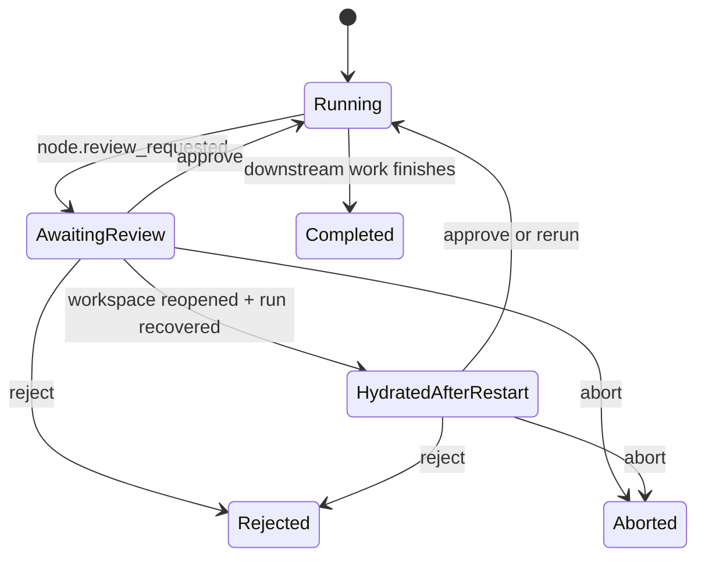

# Paused Review Recovery After Restart

## Problem

Fluxion already persists paused review state under `.fluxion/runs/<runId>.json`, but review actions were blocked after an app restart because `approveReview`, `rejectReview`, and `rerunReviewNode` required an in-memory `WorkflowEngine.currentRuntime`.

Repository evidence:

- `src/main/services/workflow-engine.ts` rejected review actions when no active runtime existed.
- `src/main/services/run-state-store.ts` already persisted `awaitingReviewNodeIds`, `reviewStatus`, `reviewSource`, and per-node attempts.

This meant a run could be visibly paused on disk but practically unrecoverable once the Electron process restarted.

## Recovery Model

Fluxion now treats paused review as resumable run state instead of a new run.

State machine:

## Runtime Rules

1. `RunStateStore.listAwaitingReviewRuns(workspacePath)` scans `.fluxion/runs/*.json`, parses valid run-state files, and returns only `status === "awaiting_review"` runs sorted by newest `updatedAt`.
2. On workspace load, Fluxion prefers the newest recoverable paused-review run and loads that run's workflow as the active workflow.
3. `workflowEngine.hydratePausedReviewRuntime(...)` rebuilds the in-memory DAG from persisted node state:
   - completed upstream nodes satisfy dependencies immediately
   - pending nodes whose prerequisites are already completed go back into `readyQueue`
   - review nodes stay blocked in `awaitingReviewNodeIds` until the user approves, rejects, reruns, or aborts
4. On approval, the engine commits the final flow-context delta before unlocking downstream neighbors, so a recovered review resumes from the same durable state that the downstream node will read.
5. Review action IPC stays unchanged. Recovery is internal to workspace loading and runtime hydration.

## Renderer Rules

- `WorkspaceOpenedPayload.recoveredReview` is optional and only present when a valid paused review was recovered.
- The renderer restores paused review UI from that payload:
  - `workflowStatus = "paused"`
  - `activeRunId`
  - review node list
  - paused node status
  - latest output path
  - attempt count
  - first review node gets terminal focus and review focus
- Approve re-validates the output file before sending IPC. Missing output stays reviewable for rerun/reject, but approve is blocked with a clear error.

## Compatibility

- No `.fluxion/runs` schema change.
- No workflow schema change.
- No review-action IPC payload change.
- No new trace event enum.
- Existing review trace events gain `recoveredAfterRestart: true` only when the action is executed from a hydrated paused runtime.

## External Evidence

- OpenAI approval lifecycle says paused approvals should keep the same run, return resumable state, and be serialized/resumed later: [Approval lifecycle](https://developers.openai.com/api/docs/guides/agents/guardrails-approvals#approval-lifecycle)
- OpenAI results/state guidance calls out pending approvals as `interruptions` plus a resumable snapshot: [Results and state](https://developers.openai.com/api/docs/guides/agents/results#choose-the-result-surface-you-need)
- OpenAI running-agents guidance says approvals are expected pauses and should resume from the same state, not a new turn: [Running agents](https://developers.openai.com/api/docs/guides/agents/running-agents#handle-pauses-and-failures-deliberately)
- OpenAI observability guidance recommends tracing for approvals and other control-flow decisions: [Integrations and observability](https://developers.openai.com/api/docs/guides/agents/integrations-observability#choose-what-lives-in-the-sdk)

## Codex Approval Note

This document is about Fluxion's own paused review lifecycle, not interactive Codex approval hosting.

Current Codex approval-host status remains blocked. See [`codex-approval-status.md`](./codex-approval-status.md).
